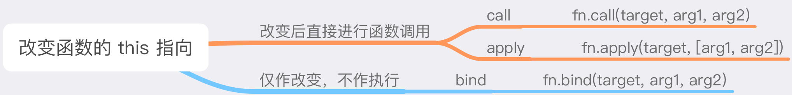

## 少数情况

上篇讲 “多数情况下” 的 this 指向，这篇讲少数情况。

改变 this 的指向，我们主要有两条路

- 箭头函数
- call/apply/bind

### 箭头函数

箭头函数的 this 会在书写阶段（即声明位置）就绑定到它父作用域的 this 上

### 构造函数

构造函数里面的 this 会绑定到我们 new 出来的这个对象上

### call/apply/bind



#### 方法的模拟

- 任何函数都能执行的，所以要绑定在 Function.prototype 上
- 改变 this 的指向
- 根据输入的参数，执行函数

call 方法模拟

```javascript
Function.prototype.myCall = function (context, ...args) {
  // ...args是rest参数，表示剩余参数，args是剩余参数数组
  args = args || [];
  // step1: 把函数挂到目标对象上（这里的 this 就是我们要改造的的那个函数）
  context.func = this;
  // step2: 执行函数
  context.func(...args);
  // step3: 执行完成删除
  delete context.func;
};
```

apply 方法模拟并且有返回

```javascript
Function.prototype.myApply = function (context, args) {
  args = args || [];
  context.func = this;
  let data = context.func(...args);
  delete context.func;
  return data;
};
```

bind 方法模拟

> bind 与 apply/call 一样都能改变函数 this 指向，但 bind 并不会立即执行函数，而是返回一个绑定了 this 的新函数，

在调用 bind 时可以先传递部分参数，在调用返回的 bound 时可以补全剩余参数。

```js
Function.prototype.myBind = function (context, ...args) {
  var _thisfn = this;
  // args 等于 [].slice.call(arguments, 1);
  args = args || [];
  var bound = function (...params) {
    return _thisfn.apply(context, args.concat(params));
  };
  return bound;
};
```
