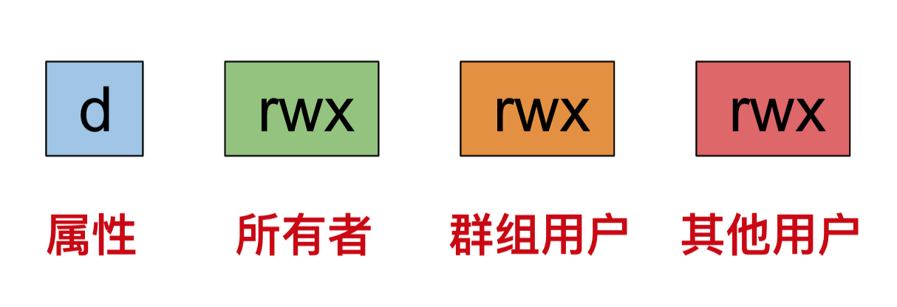

## 文件权限

Linux 系统里每个文件都有权限，我们在开发中常见到的 `Permission Deny` 问题就是权限问题。

这节来简单系统的记录下文件权限的知识。

### 查看权限

其实权限我们早见过了，在你的目录执行 `ls -l` 命令：


每行开头的 d、r、w、l、x 等字母，就是权限描述符号，具体如下：

- d：英语 directory 的缩写，表示“目录”。
- l：英语 link 的缩写，表示“链接”。
- r：英语 read 的缩写，表示“读”。
- w：英语 write 的缩写，表示“写”。
- x：英语 execute 的缩写，表示“执行，运行”。

有字母表示相应权限，短横 - 表示没有该权限。

为什么有多个重复出现的 r、w 和 x 呢？其实是按照用户来分的。



第一个字母表示属性，有三种情况：

- d：目录
- i：链接
- -：普通文件

### 修改权限

chmod 命令：修改访问权限。

但是 chmod 并不会通过 w，r 这些字符修改权限，而是通过数字。比如常见的 **777**。

其实，数字和权限字母有对应关系的，如下：

| 权限 | 数字 |
| ----- | ----- |
| r | 4 |
| w | 2 |
| x | 1 |

而合并权限，就是简单的数字相加。比如所有者权限：

| 权限 | 数字 |
| ----- | ----- |
| rwx | 4+2+1=7 |
| rw- | 4+2=6 |
| r-- | 4 |

因此，一个文件的所有用户权限如下：

| 权限组 | 数字组 |
| ----- | ----- |
| -rwxr-xr-- | 754 |
| -rw-r--r-- | 644 |
| drwxr-xr-x | 755 |

了解了这些，修改文件就简单了：

```sh
chmod 644 ./test.txt
```

如果你想递归修改某一文件夹下所有文件的权限，-R 参数来了：

```sh
chmod -R 754 ./test
```

