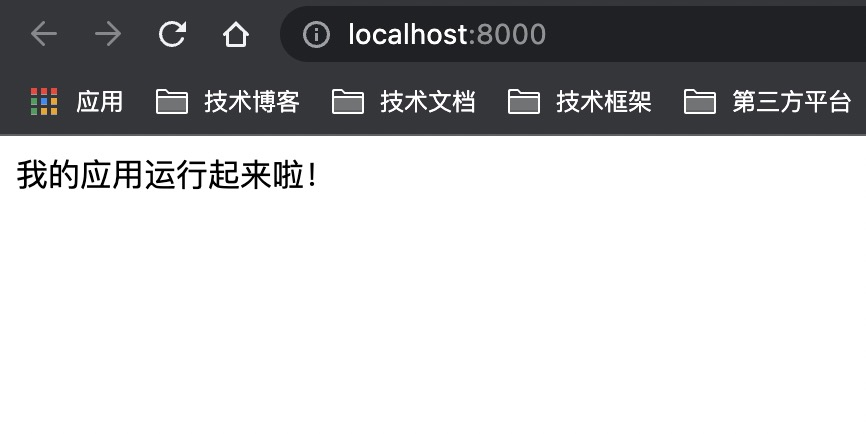

# 搭建一个轻量好用的 API 架构（一）

经过前面的几章学习，我们已经了解了如何在前端采集关键的数据信息。当这些数据积累的越来越多，我们就可以对这些数据进行统计，进而做出可视化的数据分析。

但是呢，前端采集到的这些数据，如果想要在后期使用，那么必然不可或缺的一步就是把这些数据存起来。存数据我们都知道，和平常写业务一样，调用后端的 API 接口，把数据传过去就可以了。不过区别是现在没有现成的后端，需要我们自食其力，因此从本章开始，我们要从零搭建一个完整可用的后端 API 应用。

搭建 API 应用对我们前端来说相对比较陌生，因为通常情况下这是后端的事情。不过大家也不用担心，我会用 4 个章节来详细讲述关键的思路和实现代码，带着大家一步一步走。本章作为第一章，目的也非常明确，就是首先做好最关键的第一步 ———— 搭建一个好用的**API 架构**。

搭建 API 架构，是指如何做目录结构设计，统一封装请求/响应的处理，编写工具函数等公共部分的设计和开发，实际上只是实现一个接口应用的骨架，并不是一上来就直接动手写业务接口。不管是前端还是后端，我认为在业务开发之前，首先花时间思考和设计一个适合自己的，符合实际情况的的应用架构，往往会使后面的开发事半功倍。

从本章开始，我们就完全进入 Node.js 的世界了。主要的介绍内容不再是前端，而是真真实实的后端 API 应用，我们要和服务端打交道了！好消息是我们依然使用 JavaScript 语法，语言没有变，学习成本不高，需要的是大家转换思路，从前是面向前端，现在是面向接口。

## 为什么要选择 Node.js？

Node.js 是一个基于 Chrome V8 引擎的 JavaScript 运行时，它可以运行在服务端，目前有大量基于 Node.js 开发的应用已经运行在生产环境。同时它是天生的事件驱动、非阻塞式 I/O 的模型，轻量又高效，在并发能力方面优势突出。

对于前端开发者而言，当我们想尝试服务端开发，首先想到的就是用 Node.js。为什么？因为它说到底还是 js 嘛，对我们来说再熟悉不过，不必再去学习一门新的服务端语言。

除此之外，还要再结合实际情况考虑。因为我们要做的这个 API 应用本身复杂度不高，基本上只是存数据，查数据，没有非常重的逻辑。但是呢 API 调用的频率可能会比较高，而且主要集中在数据写入方面，因为用户操作就会产生数据，就需要采集写入。

综上所述，我们需要的是一个门槛低，复杂度不高，也就是尽可能轻量，并且并发性能还不错的方案。没得说，Node.js 自然是首选。

还有一个我们需要考虑的问题，就是`开发效率`。像前端开发一样，大部分的项目不会直接用 Javascript 去开发，总要选择一个框架，如 Jquery，Vue，因为框架帮我们做好了那些重复低效的事情，我们可以把更多精力放在产品功能的实现上面。

Node.js 也一样，也需要选择一个框架来提升开发效率，这里我们选择最流行的 `Express` 框架。Express 是老牌的经典框架，周边的解决方案（npm 包）非常丰富，社区里的学习资源和踩坑记录也都非常之多，并且足够简单轻量。

因此我们的技术选型方案就是：`Node.js + Express`。

## 用 express 搭建项目

首先安装 [Node.js](http://nodejs.cn/)，我使用的稳定版本是 `v14.17.4`，后面的代码都是运行在这个版本之下，建议同学们务必与我的版本保持统一。

接下来初始化项目，在终端执行命令：`npm init`，根据提示输入项目基本信息，然后回车，就会生成 `package.json` 文件。完成后再安装 express 框架：

```shell
$ npm install --save express
```

第一次安装 npm 包，项目下会生成 `node_modules` 文件夹和 `package-lock.json` 文件，这就是最基本的 Node.js 项目结构，之后安装的其他 npm 包都会在这里存储和标记。

第三步在项目根目录下新建一个 `app.js` 文件。这个文件非常重要，是应用的入口文件，这里定义了 express 的初始化，监听的端口，以及路由注册，异常捕获等等，相当于是应用的全局生命周期。

我们在 `app.js` 中先写一部分基础的代码：

```javascript
const express = require('express')
const app = express()

app.get('/', (req, res, next) => {
  res.send('我的应用运行起来啦！')
})

app.listen(8000, () => {
  console.log(`listen to http://localhost:8000`)
})
```

现在在控制台执行 `node app.js`，然后会看到控制台打印出 **listen to http://localhost:8000**，我们在浏览器中打开这个地址，结果如下：



看到没有，简单的几行代码，一个 web 服务器就运行起来了。不过这只是最简单的 Demo，接下来我们逐步完善这个入口文件，顺带着介绍一些关键的知识点。

## 完善入口文件

上面我们运行起来的 Demo 非常简单，相比实际的 API 应用还差许多功能。首先我们把欠缺的 npm 包统一安装一下，后面直接使用就可以了。

#### body-parser

这个包的作用是解析 post 请求传过来的 body 数据。因为在 Nodejs 原生的 http 模块中，请求体是要基于流的方式来接受和解析，而 body-parser 可以帮助我们直接获取。

#### cors

做前端开发的同学们一定常常碰到`跨域`问题，而跨域问题的主要解决方案还是在后端。`cors` 这个包的作用就是帮助 API 应用非常简单的解决跨域问题。

#### express-jwt

一个成熟的 API 是不允许被随意调用的，需要经过鉴权才可以发起请求。目前比较流行的鉴权方式，也是我认为非常好用的，就是 [JWT](https://jwt.io/) 认证。而 `express-jwt` 是 JWT 认证方式的一种实现，目的是为了更简单的集成到 express 框架。

上述的这三个包一起安装：

```shell
$ npm install --save body-parser cors express-jwt
```

### 配置 body 解析与跨域

在 `app.js` 中引入 **body-parser** 与 **cors** 并进行配置：

```javascript
// app.js
const bodyParser = require('body-parser')
const cors = require('cors')

// 解析 json 格式的请求体数据
app.use(bodyParser.json())
// 解决跨域
app.use(cors())
```

这里的 `bodyParser.json()` 的作用是，解析格式为 `application/json` 的请求体数据。我们规定 POST/PUT 请求参数统一为 json 格式，因此配置解析 json 就可以。

### 配置路由中间件

路由是整个应用当中最关键的一部分，其实在开始的 demo 中我们已经定义了一个路由：

```javascript
app.get('/', (req, res, next) => {
  res.send('我的应用运行起来啦！')
})
```

这个路由的含义是，当我们以 `GET` 方式请求路径 `/` 的时候，会返回一段文本，文本内容就是 **我的应用运行起来啦！** 。因此我们在浏览器直接访问时会看到这段文本。

Express 中定义路由的方法有 5 种：

- `app.get`：定义 GET 请求
- `app.post`：定义 POST 请求
- `app.put`：定义 PUT 请求
- `app.delete`：定义 DELETE 请求
- `app.all`：定义任意请求，同时包含 GET，POST，PUT，DELETE

这 5 种路由定义都采用以下结构：

```javascript
app.METHOD(PATH, HANDLER)
```

其中 `PATH` 代表请求路径，`HANDLER` 代表一个处理程序函数，这个函数会在 `PATH` 匹配的时侯执行。

这里还有一个知识点：上述的 5 种路由定义方法，在 express 中被称为`中间件`。中间件不是一个高大上的概念，它可以理解为是程序运行的一个环节，这个环节我们可以任意定义，并指定一个`中间件函数`，上面的`HANDLER` 就是一个中间件函数。

中间件函数能够访问请求对象 `req`，响应对象 `res`，以及执行下一个中间件的函数`next`。由此可见中间件函数会在`匹配到某个请求`时执行，此时你可以获取到请求相关的信息，或者决定如何对请求作出响应，甚至可以不做任何处理，执行下一个中间件。

> 注意：如果你想执行下一个中间件，必须手动调用 next() 方法。

继续看最开始的例子：

```javascript
app.get('/', (req, res, next) => {
  // req：表示请求对象
  // res：表示响应对象
  // next：函数，表示执行下一个中间件
  res.send('我的应用运行起来啦！')
})
```

如果我想在每次请求之前，打印一下当前时间，那么就可以改一下代码，在最前面加一个中间件，如下：

```javascript
// 任意方法，任意路径的请求
app.all('*', (req, res, next) => {
  console.log('Time:', Date.now())
  next() // 执行下一个中间件
})

app.get('/', (req, res, next) => {
  res.send('我的应用运行起来啦！')
})
```

现在你可以试一下，每次请求，控制台就会打印出当前时间了。（注：修改代码后不会立即生效，需要在终端手动关闭启动，重新执行 `node app.js`）

请记住这个结论：**Express 应用程序的运行基本就是一系列中间件函数的调用**。

### 配置其他中间件

上面讲的路由中间件，有一个特点，就是需要指定一个 `PATH` 参数，当 PATH 匹配时才会执行中间件函数。事实上 express 还提供了一个直接挂载中间件函数的方式，不需要匹配 PATH。

这个方式就是 `app.use`。

使用 app.use() 方法挂载中间件非常简单，只要把中间件函数作为参数即可：

```javascript
app.use((req, res, next) => {
  console.log('Time:', Date.now())
  next()
})
```

回想一下，前面配置 **body-parser** 和 **cors** 时也是用的 `app.use()` 方法。没错，这两个第三方包也是中间件，它们被称为`第三方中间件`。

现在思考一个问题：前面配置了路径为 `/` 的路由，如果我此时访问 `/a`，会发生什么事情？

在浏览器尝试一下，发现请求被挂起了。挂起的意思是浏览器一直转圈，但没有任何响应，为什么呢？因为路径 _/a_ 没有匹配到任何中间函函数，也没有后置的中间件函数兜底，所以没有做任何响应处理，因此请求被挂起。

所以欠缺的第一个中间件，是用于处理路由未匹配，即 404 情况的中间件。这个中间件的位置在所有路由中间件之后，只有当前面的路由没有匹配到的时候才会走到这里，因此只用于处理 404 的情况。代码如下：

```javascript
// catch 404
app.use((req, res, next) => {
  res.status(404).send('Not Found')
})
```

现在访问 `http://localhost:8000/a`，浏览器会返回文本 _Not Found_。

除了可能访问不存在的路由，还有一种情况，就是如果代码中发生异常，应该如何向浏览器响应？express 有一个默认的错误处理中间件，会输出异常位置，以及对应的文件路径。不过这种方式最好不要用于线上，因为会暴露服务器相关信息，所以我们需要自定义一个错误处理中间件。

错误处理中间件函数与其他中间件函数有一个不同点，就是共有 4 个参数，第一个参数 `err` 表示错误信息，后面的三个参数与普通中间件函数一样。这个中间件要放在所有中间件的末尾，代码如下：

```javascript
// error handler
app.use((err, req, res, next) => {
  console.error(err)
  res.status(err.status || 500).json({ message: '服务器内部错误' })
})
```

补充了 404 中间件和错误处理中间件，入口文件的中间件的部分基本就完整了。

### 总结

这篇主要和大家介绍了搭建 API 架构的重要性，以及为什么选择 Node.js 和 Express。然后是从头建设并完善了入口文件 `app.js`，顺带介绍了路由和中间件的知识点。

总结一下关键信息：

- Node.js：服务端的 JavaScript，统一安装 `v14.17.4` 的版本。
- Express：Node.js 的经典框架，提供轻量高效的接口应用开发能力。
- 中间件：Express 应用由一系列中间件组成，是最重要的概念。
- 路由：最关键的中间件，用于定义请求 url，method 以及相应的处理函数。

下一篇我们完善目录结构，实现 jwt 验证和模块化的路由。
