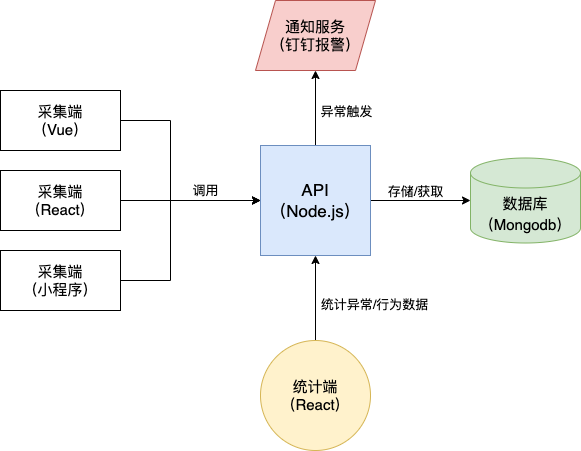

介绍小册的主要内容（比如，可以用三段话来讲清楚这件事）。

- 为什么要讲这本小册
- 分几个内容模块？可以从用户可以获取的核心知识点来介绍，还可以将课程特色与内容结合扩展介绍
- 给出学习目标，期待这门课给用户交付什么技能或效果，帮助用户解决什么问题

标题：从 0 到 1 全栈开发前端监控平台

首先聊一下，为什么前端应该有监控系统？

当一个前端项目部署到线上，经常会碰到以下情况：

- 按钮点击没反应
- 某个页面白屏
- 偶然性的表单提交失败
- 接口调用报错
- 其他未知异常

这些问题在排查时都有一个共同的难点：`难以复现`。

比如按钮点击没反应，开发人员测试没问题，但是用户点击确实有问题。这种情况就很难判断是前端问题还是接口问题，或者是其他问题，因此定位问题非常困难，解决效率也就会非常低。

除了如何定位问题，更重要的还是如何发现问题。可能某些场景下发生的异常，如果用户不反馈，我们甚至都不知道会有这个异常。

但是前端如果有监控，当我们在监听到异常时，就可以获取到当前时刻的相关信息。比如由谁触发，哪个页面，哪个按钮，提交数据是什么，错误信息是什么，获取到这些信息后调用接口保存在数据库，并上报通知系统，此时开发人员就可以第一时间知道有异常触发，再通过错误信息定位问题，解决效率就会成倍提升。

除了上面说的，如何利用监控复现和定位问题，前端监控还可以生成运营数据。

比如前端在每次路由切换时，获取到当前页面信息和用户信息，以及停留时间等，把这些信息存起来，然后做成统计，就可以很容易的拿到应用的 PV，UV，以及某个页面的访问频率，停留时间等等，这些信息可以帮助运营同学更好的了解线上的运营状况。

了解了前端监控的必要性，再来看前端监控要落地会有什么困难。

首先，采集的异常数据也好，行为数据也好，都需要存储，存储方案有两种：

1. 第三方监控平台，调用 API 即可
2. 自研监控平台，自己实现采集，存储，分析等等

异常与行为数据，一般是与用户以及应用等隐私信息相关，这些信息比较敏感。存在免费的第三方平台不可靠，收费的又成本高，而且无法自由灵活的利用数据，因此我们选择自研。

这个小册的目标是从 0 到 1 实现一个前端监控平台，因此是一个全栈项目，技术栈为：

**React + Node.js + Mongodb**

总体的设计结构我画了一张图：

对应到小册，以下是我的模块和具体目录的设计：

- 为什么前端应该有监控系统？
- 思路篇：如何设计监控系统？
- 采集篇：异常采集
- 采集篇：行为采集
- 采集篇：难点思路汇总
- API 篇：搭建一个轻量好用的 API 架构
- API 篇：jwt 权限验证与登录逻辑
- API 篇：请求验证与响应处理
- API 篇：其他要点汇总
- 数据库篇：和 Mongodb 说你好
- 数据库篇：Schema 设计与编写
- 数据库篇：基本增查改删实现
- 数据库篇：聚合管道查询
- 统计篇：通用筛选条件封装
- 统计篇：总体与用户统计
- 统计篇：各类分布统计
- 统计篇：各类频率统计
- 统计篇：异常统计与检索
- 可视化篇：快速搭建前端项目结构
- 可视化篇：页面路由与状态划分
- 可视化篇：请求封装与数据获取
- 可视化篇：图表展视页面
- 可视化篇：异常检索页面
- 报警篇：了解钉钉机器人
- 报警篇：编写通知模版
- 报警篇：发送报警通知
- 部署篇：前后端上线与配置
- 完结篇：再回顾，你学会了什么？

1. 客户端采集

- 1.1 数据结构设计
- 1.2 采集方案（侵入式和非侵入式）
- 1.3 接口异常采集
- 1.4 前端异常采集
- 1.5 如何设计行为采集（埋点）？
- 1.6 行为采集
- 1.7 难点优化：计算用户停留时间

2. API 编写

- 2.1 Node.js 与 Express
- 2.2 本地环境搭建
- 2.3 轻量好用的 API 架构
- 2.4 jwt 权限验证
- 2.5 请求参数验证
- 2.6 统一响应格式封装
- 2.7 跨域处理

1. 数据库操作

- 3.1 认识 Mongodb
- 3.2 用前端思想理解 Mongodb
- 3.3 设计数据库集合
- 3.4 用 mongoose 编写数据结构
- 3.5 数据写入
- 3.6 普通查询
- 3.7 聚合管道查询
- 3.8 如何分页

4. 统计端（前端）

- 4.1 框架选型
- 4.2 状态管理选型
- 4.4 图表库选型
- 4.5 TS 接口类型定义
- 4.6 全局请求处理
- 4.7 时间与环境筛选
- 4.8 异常信息展示

5. 统计端（接口）

- 5.1 PV/PV 等总体统计
- 5.2 时间筛选封装
- 5.3 环境与终端占比统计
- 5.4 用户访问统计
- 5.5 页面访问频率统计
- 5.6 页面停留时长统计
- 5.7 月访问频率统计
- 5.8 接口报错频次统计
- 5.9 前端报错分布统计

6. 通知服务

- 6-1 什么是钉钉机器人
- 6-2 简单获取一个 webhook
- 6.3 markdown 编写通知模版
- 6.4 编写触发通知类
- 6.5 发送通知与检查

7. 线上部署

- 7-1 前端部署
- 7-2 数据库部署
- 7-3 pm2 部署接口
- 7-4 nginx 解析

最后说，通过这本小册，你能学到什么？

第一，这是一个全栈项目，非常适合一直在做纯前端，需要突破边界的小伙伴。这本小册的目标是“交付一个应用”，所以会从产品，数据，接口，前端思考并实现一个完整的应用。

第二，这是一个从零开始的项目，每一个章节我都会讲为什么用某个技术点，以及从零搭建的步骤，因此也非常适合前端萌新尝试，体验一遍应用从零到一诞生的流程。

第三，除了前端 React 技术栈外，本篇有大部分的技术介绍 Node.js+Mongodb 的接口开发，因此同样适合做 Node.js 开发的小伙伴参阅。

最后，前端监控在规模较大的前端项目上必要性越来越高，因此这不是一个学习性或实验性的项目，这是一个实用性非常高，可以真正解决线上问题的产品。同时这个项目的编码和设计风格会有我 5 年的经验在里面，所以项目的代码质量，规范性也会比较高。

购买者可进小册微信交流群，与作者和其他读者互相交流学习。同时应用源码开放，更便于大家学习。
