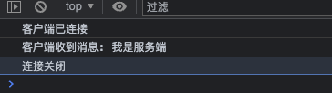

# 搭建 WebSocket 应用

[掘金标题]前端架构师破局技能，NodeJS 落地 WebSocket 实践【源码+答疑】

本文从网络协议，技术背景，安全和生产应用的方向，详细介绍 WebSocket 在 Node.js 中的落地实践。

## 大纲预览

本文介绍的内容包括以下方面：

- 网络协议进化
- Socket.IO？
- ws 模块实现
- Express 集成
- WebSocket 实例
- 消息广播
- 安全与认证
- BFF 应用

## 网络协议进化

HTTP 协议是前端最熟悉的网络通信协议。我们通常的打开网页，请求接口，都属于 HTTP 请求。

HTTP 请求的特点是：`请求-> 响应`。客户端发起请求，服务端收到请求后进行响应，一次请求就完成了。也就是说，HTTP 请求必须由客户端发起，服务端才能被动响应。

除此之外，发起 HTTP 请求之前，还需要通过三次握手建立 TCP 连接。HTTP/1.0 的特点是，每通信一次，都要经历 “三步走” 的过程 —— `TCP 连接 -> HTTP 通信 -> 断开 TCP 连接`。

这样的每一次请求都是独立的，一次请求完成连接就会断开。

HTTP1.1 对请求过程做了优化。TCP 连接建立之后，我们可以进行多次 HTTP 通信，等到一个时间段无 HTTP 请求发起 TCP 才会断开连接，这就是 HTTP/1.1 带来的**长连接**技术。

但是即便如此，通信方式依然是客户端发起，服务端响应，这个根本逻辑不会变。

随着应用交互的复杂，我们发现，有一些场景是必须要实时获取服务端消息的。

比如即时聊天，比如消息推送，用户并不会主动发起请求，但是当服务器有了新消息，客户端需要立刻知道并且反馈给用户。

HTTP 不支持服务端主动推送，但是这些场景又急需解决方案，于是早期出现了**轮询**（polling）。轮询是客户端定时向服务器发起请求，检测服务端是否有更新，如果有则返回新数据。

这种轮询方式虽然简单粗暴，但很显然有两个弊端：

1. **请求消耗太大**。客户端不断请求，浪费流量和服务器资源，给服务器造成压力。
2. **不能保证及时**。客户端需要平衡及时性和性能，请求间隔必然不能太小，因此会有延迟。

随着 HTML5 推出 `WebSocket`，即时通讯场景终于迎来了根本解决方案。`WebSocket` 是全双工通信协议，当客户端与服务端建立连接之后，双方可以互相发送数据，这样的话就不需要客户端通过轮询这种低效的方式获取数据，服务端有新消息直接推送给客户端即可。

传统 HTTP 连接方式如下：

```shell
# 普通连接
http://localhost:80/test
# 安全连接
https://localhost:80/test
```

WebSocket 是另一种协议，连接方式如下：

```shell
# 普通连接
ws://localhost:80/test
# 安全连接
wss://localhost:80/test
```

但是 WebSocket 也不是完全脱离 HTTP 的，若要建立 WebSocket 连接，则必须要客户端主动发起一个建立连接的 HTTP 请求，连接成功之后客户端与服务端才能进行双向通信。

## Socket.IO？

提起用 Node.js 实现 WebSocket，大家一定会想到一个库：[Socket.IO](https://socket.io/)

没错，Socket.IO 是目前 Node.js 在生产环境中开发 WebSocket 应用最好的选择。它功能强大，高性能，低延迟，并且可以一步集成到 `express` 框架中。

但是也许你不清楚，Socket.IO 并不是一个纯粹的 WebSocket 框架。它是将 Websocket 和轮询机制以及其它的实时通信方式封装成了通用的接口，以实现更高效的双向通信。

严格来说，Websocket 只是 Socket.IO 的一部分。

也许你会问：既然 Socket.IO 在 WebSocket 的基础上做了那么多的优化，并且非常成熟，那为什么还要搭一个原生 WebSocket 服务？

首先，Socket.IO 不能通过原生的 `ws` 协议连接。比如你在浏览器试图通过 `ws://localhost:8080/test-socket` 这种方式连接 Socket.IO 服务，是连接不上的。因为 Socket.IO 的服务端必须通过 Socket.IO 的客户端连接，不支持默认的 Websocket 方式连接。

其次，Socket.IO 封装程度非常高，使用它可能不利于你了解 WebSocket 建立连接的原理。

因此，我们本篇就用 Node.js 中基础的 `ws` 模块，从头开始实现一个原生的 WebSocket 服务，并且在前端用 ws 协议直接连接，体验一把双向通信的感觉！

## ws 模块实现

[ws](https://github.com/websockets/ws) 是 Node.js 下一个简单快速，并且定制程度极高的 WebSocket 实现方案，同时包含了服务端和客户端。

用 `ws` 搭建起来的服务端，浏览器可以通过原生 `WebSocket` 构造函数直接连接，非常便捷。ws 客户端则是模拟浏览器的 WebSocket 构造函数，用于连接其他 WebSocket 服务器进行通信。

注意一点：`ws` 只能在 Node.js 环境中使用，浏览器中不可用，**浏览器请直接使用原生 WebSocket 构造函数**。

下面开始接入，第一步，安装 ws：

```sh
$ npm install ws
```

安装好后，我们先搭建一个 ws 服务端。

### 服务端

搭建 websocket 服务器需要用 WebSocketServer 构造函数。

```js
const { WebSocketServer } = require('ws')
const wss = new WebSocketServer({
  port: 8080
})
wss.on('connection', (ws, req) => {
  console.log('客户端已连接：', req.socket.remoteAddress)
  ws.on('message', data => {
    console.log('收到客户端发送的消息：', data)
  })
  ws.send('我是服务端') // 向当前客户端发送消息
})
```

把这段代码写进 `ws-server.js` 然后运行：

```sh
$ node ws-server.js
```

这样一个监听 `8080` 端口的 WebSocket 服务器就已经跑起来了。

### 客户端

上一步建好了 WebSocket 服务器，现在我们在前端连接并监听消息：

```js
var ws = new WebSocket('ws://localhost:8080')

ws.onopen = function(mevt) {
  console.log('客户端已连接')
}
ws.onmessage = function(mevt) {
  console.log('客户端收到消息: ' + evt.data)
  ws.close()
}
ws.onclose = function(mevt) {
  console.log('连接关闭')
}
```

将代码写入 `wsc.html` 然后浏览器打开，打印如下：



可以看到，浏览器连接成功后，收到服务端主动推送过来的消息，然后浏览器可以主动关闭连接。

Node.js 环境下我们看 ws 模块如何发起连接：

```js
const WebSocket = require('ws')
var ws = new WebSocket('ws://localhost:8080')

ws.on('open', () => {
  console.log('客户端已连接')
})
ws.on('message', data => {
  console.log('客户端收到消息: ' + data)
  ws.close()
})
ws.on('close', () => {
  console.log('连接关闭')
})
```

代码与浏览器的逻辑一摸一样，只是写法稍有些不同，注意区别。

需要特殊说明的一点，浏览器端监听 `message` 事件的回调函数，参数是一个 [MessageEvent](https://developer.mozilla.org/zh-CN/docs/Web/API/MessageEvent) 的实例对象，服务端发来的实际数据需要通过 `mevt.data` 获取。

而在 ws 客户端，这个参数就是服务端的实际数据，直接获取即可。

## Express 集成

ws 模块一般不会单独使用，更优的方案是集成到现有的框架中。这节我们将 ws 模块集成到 [Express](https://expressjs.com/zh-cn/) 框架。

集成到 Express 框架的优点是，我们不需要单独监听一个端口，使用框架启动的端口即可，并且我们还可以指定访问到某个路由，才发起 WebSocket 连接。

幸运的是这一切不需要手动实现，[express-ws](https://github.com/HenningM/express-ws) 模块已经帮我们做好了大部分的集成工作。

首先安装，然后在入口文件引入：

```javascript
var expressWs = require('express-ws')(app)
```

和 Express 的 Router 一样，express-ws 也支持注册全局路由和局部路由。

先看全局路由，通过 `[host]/test-ws` 连接：

```javascript
app.ws('/test-ws', (ws, req) => {
  ws.on('message', msg => {
    ws.send(msg)
  })
})
```

局部路由则是注册在一个**路由组**下面的子路由。配置一个名为 `websocket` 的路由组并指向 `websocket.js` 文件，代码如下：

```javascript
// websocket.js
var router = express.Router()

router.ws('/test-ws', (ws, req) => {
  ws.on('message', msg => {
    ws.send(msg)
  })
})

module.exports = router
```

连接 `[host]/websocket/test-ws` 就可以访问到这个子路由。

路由组的作用是定义一个 websocket 连接组，不同需求连接这个组下的不同子路由。比如可以将 `单聊` 和 `群聊` 设置为两个子路由，分别处理各自的连接通信逻辑。

完整代码如下：

```javascript
var express = require('express')
var app = express()
var expressWs = require('express-ws')(app)
var webSocket = require('./websocket.js')

app.ws('/test-ws', (ws, req) => {
  ws.on('message', msg => {
    ws.send(msg)
  })
})

app.use('/websocket', webSocket)

app.listen(3000)
```

实际开发中获取常用信息的小方法：

```javascript
// 客户端的IP地址
req.socket.remoteAddress
// 连接参数
req.query
```

## WebSocket 实例

WebSocket 实例是指客户端连接对象，以及服务端连接的第一个参数。

```javascript
var ws = new WebSocket('ws://localhost:8080')
app.ws('/test-ws', (ws, req) => {}
```

代码中的 `ws` 就是 WebSocket 实例，表示建立的连接。

### 浏览器

浏览器的 ws 对象中包含的信息如下：

```javascript
{
  binaryType: 'blob'
  bufferedAmount: 0
  extensions: ''
  onclose: null
  onerror: null
  onmessage: null
  onopen: null
  protocol: ''
  readyState: 3
  url: 'ws://localhost:8080/'
}
```

首先非常关键的是四个监听属性，用于定义函数：

- `onopen`：连接建立后的函数
- `onmessage`：收到服务端推送消息的函数
- `onclose`：连接关闭的函数
- `onerror`：连接异常的函数

其中最常用的是 `onmessage` 属性，赋值为一个函数来监听服务端消息：

```javascript
ws.onmessage = mevt => {
  console.log('消息：', mevt.data)
}
```

还有一个关键属性是 `readyState`，表示连接状态，值为一个数字。并且每个值都可以用`常量`表示，对应关系和含义如下：

- `0`: 常量 `WebSocket.CONNECTING`，表示正在连接
- `1`: 常量 `WebSocket.OPEN`，表示已连接
- `2`: 常量 `WebSocket.CLOSING`，表示正在关闭
- `3`: 常量 `WebSocket.CLOSED`，表示已关闭

当然最重要的还有 `send` 方法用于发送信息，向服务端发送数据：

```javascript
ws.send('要发送的信息')
```

### 服务端

服务端的 ws 对象表示当前发起连接的一个客户端，基本属性与浏览器大致相同。

比如上面客户端的四个监听属性，`readyState` 属性，以及 `send` 方法都是一致的。不过因为服务端是 Node.js 实现，因此会有更丰富的支持。

比如下面两种监听事件的写法效果是一样的：

```javascript
// Node.js 环境
ws.onmessage = str => {
  console.log('消息：', str)
}
ws.on('message', str => {
  console.log('消息：', mevt.data)
})
```

详细的属性和介绍可以查阅[官方文档](https://github.com/websockets/ws/blob/master/doc/ws.md#class-websocket)

## 消息广播

WebSocket 服务器不会只有一个客户端连接，消息广播的意思就是把信息发给所有已连接的客户端，像一个大喇叭一样，所有人都听得到，经典场景就是热点推送。

那么广播之前，就必须要解决一个问题，**如何获取当前已连接（在线）的客户端**？

其实 `ws` 模块提供了快捷的获取方法：

```javascript
var wss = new WebSocketServer({ port: 8080 })
// 获取所有已连接客户端
wss.clients
```

方便吧。再看 `express-ws` 怎么获取：

```javascript
var wsServer = expressWebSocket(app)
var wss = wsServer.getWss()
// 获取所有已连接客户端
wss.clients
```

拿到 `wss.clients` 后，我们看看它到底是什么样子。经过打印，发现它的数据结构比想象到还要简单，就是由所有在线客户端的 WebSocket 实例组成的一个 `Set` 集合。

那么，获取当前在线客户端的数量：

```javascript
wss.clients.size
```

简单粗暴的实现广播：

```javascript
wss.clients.forEach(client => {
  if (client.readyState === 1) {
    client.send('广播数据')
  }
})
```

这是非常简单，基础的实现方式。试想一下如果此刻在线客户有 10000 个，那么这个循环多半会卡死吧。因此才会有像 socket.io 这样的库，对基础功能做了大量优化和封装，提高并发性能。

上面的广播属于`全局广播`，就是将消息发给所有人。然而还有另一种场景，比如一个 5 人的群聊小组聊天，这时的广播只是给这 5 人小团体发消息，因此这也叫 `局部广播`。

局部广播的实现要复杂一些，一般会揉合具体的业务场景。这就需要我们在客户端连接时，对客户端数据做持久化处理了。比如用 `Redis` 存储在线客户端的状态和数据，这样检索分类更快，效率更高。

局部广播实现，那一对一私聊就更容易了。找到两个客户端对应的 WebSocket 实例互发消息就行。

## 安全与认证

前面搭建好的 WebSocket 服务器，默认任何客户端都可以连接，这在生产环境肯定是不行的。我们要对 WebSocket 服务器做安全保障，主要是从两个方面入手：

1. Token 连接认证
2. wss 支持

下面说一说我的实现思路。

### Token 连接认证

HTTP 请求接口我们一般会做 [JWT](https://jwt.io/) 认证，在请求头中带一个指定 Header，将一个 token 字符串传过去，后端会拿这个 token 做校验，校验失败则返回 401 错误阻止请求。

我们上面说过，`WebSocket` 建立连接的第一步是客户端发起一个 HTTP 的连接请求，那么我们在这个 HTTP 请求上做验证，如果验证失败，则中段 WebSocket 的连接创建，不就可以了？

顺着这个思路，我们来改造一下服务端代码。

因为要在 HTTP 层做校验，所以用 `http` 模块创建服务器，关掉 WebSocket 服务的端口。

```javascript
var server = http.createServer()
var wss = new WebSocketServer({ noServer: true })

server.listen(8080)
```

当客户端通过 `ws://` 连接服务端时，服务端会进行协议升级，也就是将 http 协议升级成 websocket 协议，此时会触发 `upgrade` 事件：

```javascript
server.on('upgrade', (request, socket) => {
  // 用 request 获取参数做验证
  // 1. 验证不通过判断
  if ('验证失败') {
    socket.write('HTTP/1.1 401 Unauthorized\r\n\r\n')
    socket.destroy()
    return
  }
  // 2. 验证通过，继续建立连接
  wss.handleUpgrade(request, socket, _, ws => {
    wss.emit('connection', ws, request)
  })
})

// 3. 监听连接
wss.on('connection', (ws, request) => {
  console.log('客户端已连接')
  ws.send('服务端信息')
})
```

这样服务端认证添加完毕，具体的认证方法结合客户端的传参方式来定。

WebSocket 客户端连接不支持自定义 Header，因此不能用 JWT 的方案，可用方案有两种：

- Basic Auth
- Quary 传参

`Basic Auth` 认证简单说就是账号+密码认证，而且账号密码是带在 URL 里的。

假设我有账号是 **ruims**，密码是 **123456**，那么客户端连接是这样：

```javascript
var ws = new WebSocket('ws://ruims:123456@localhost:8080')
```

那么服务端就会收到这样一个请求头：

```javascript
wss.on('connection', (ws, req) => {
  if(req.headers['authorization']) {
    let auth = req.headers['authorization']
    console.log(auth)
    // 打印的值：Basic cnVpbXM6MTIzNDU2
  }
}
```

其中 **cnVpbXM6MTIzNDU2** 就是 `ruims:123456` 的 base64 编码，服务端可以获取到这个编码来做认证。

`Quary` 传参比较简单，就是普通的 URL 传参，可以带一个短一点的加密字符串过去，服务端获取到该字符串然后做认证：

```javascript
var ws = new WebSocket('ws://localhost:8080?token=cnVpbXM6MTIzNDU2')
```

服务端获取参数：

```javascript
wss.on('connection', (ws, req) => {
  console.log(req.query.token)
}
```

### wss 支持

WebSocket 客户端使用 `ws://` 协议连接，那 wss 是什么意思？

其实非常简单，和 https 原理一摸一样。

`https` 表示安全的 http 协议，组成是 **HTTP + SSL**

`wss` 则表示安全的 ws 协议，组成是 **WS + SSL**

那为什么一定要用 wss 呢？除了安全性，还有一个关键原因是：如果你的 web 应用是 https 协议，你在当前应用中使用 WebSocket 就必须是 wss 协议，否则浏览器拒绝连接。

配置 wss 直接在 https 配置中加一个 `location` 即可，直接上 nginx 配置：

```nginx
location /websocket {
  proxy_pass http://127.0.0.1:8080;
  proxy_redirect off;
  proxy_http_version 1.1;
  proxy_set_header Upgrade $http_upgrade;
  proxy_set_header Connection upgrade;
}
```

然后客户端连接就变成了这样：

```javascript
var ws = new WebSocket('wss://[host]/websocket')
```

## BFF 应用

BFF 或许你听说过，全称是 `Backend For Frontend`，意思是为前端服务的后端，在实际应用架构中属于前端和后端的一个 `中间层`。

这个中间层一般是由 Node.js 实现，那么它有什么作用呢？

众所周知，现在后端的主流架构是微服务，微服务情况下 API 会划分的非常细，商品服务就是商品服务，通知服务就是通知服务。当你想在商品上架时给用户发一个通知，可能至少需要调两个接口。

这样的话对前端其实是不友好的，于是后来出现了 BFF 中间层，相当于一个后端请求的中间代理站，前端可以直接请求 BFF 的接口，然后 BFF 再向后端接口请求，将需要的数据组合起来，一次返回前端。

那我们在上面讲的一大堆 WebSocket 的知识，在 BFF 层如何应用呢？

我想到的应用场景至少有 4 个：

1. 查看当前在线人数，在线用户信息
2. 登录新设备，其他设备退出登录
3. 检测网络连接/断开
4. 站内消息，小圆点提示

这些功能以前是在后端实现的，并且会与其他业务功能耦合。现在有了 BFF，那么 WebSocket 完全可以在这一层实现，让后端可以专注核心数据逻辑。

由此可见，掌握了 WebSocket 在 Node.js 中的实践应用，作为前端的我们可以破除内卷，在另一个领域继续发挥价值，岂不美哉？

## 源码+答疑

这篇文章写到这里，我看了下字数统计，竟然超过了一万字 😱

本文所有的代码都是经过我亲自实践，为了便于小伙伴们查阅和试验，我建了一个 GitHub 仓库专门存放本文的完整源码，以及之后文章的完整源码。

仓库地址在这里：[杨成功的博客源码](https://github.com/ruidoc/blog-codes)

欢迎大家查阅和试验，如果碰到疑惑的地方，欢迎加我微信 `ruidoc` 咨询，以及所有有关 WebSocket 实践过程中的心得想法问题都欢迎和我交流～

## 我的专栏

本文首发于掘金专栏[前端 DevOps](https://juejin.cn/column/7008034440890810398)，这个专栏会长期输出前端工程与架构方向的文章，一如既往的保障质量。

这里再推荐一下我之前的一篇文章[前端架构师神技，三招统一代码风格](https://juejin.cn/post/7029512357428592648)，这篇详细介绍了如何一步一步制定代码规范，代码校验，代码格式化，对统一团队代码风格的前端人员非常有用。

不知道为什么掘金的推荐算法给这篇文章的曝光非常少，我觉得可惜，那就手动推荐一下吧，感谢 🙏
