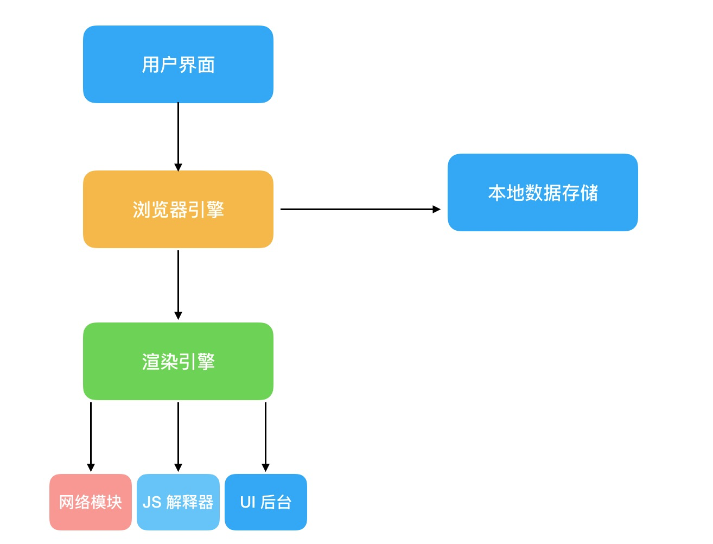

# 浏览器组成

你一定见过这样一道面试题：

> 从输入 URL 到页面加载完成，发生了什么？

这个问题的答案涉及到 `浏览器渲染`和 `计算机网络`两大块的知识，这一章就带着这个问题，深扒一下浏览器的相关知识。

### 浏览器“零部件”解密

先来看看浏览器有哪些零部件组成

总体分为三大部分：

1. 用户界面
2. 浏览器引擎
3. 渲染引擎
4. 其他（js引擎，网络模块，UI后台）

用户界面是浏览器的UI部分。每一个鼠标，键盘操作，都是计算机的“命令”。

用户界面会把命令传给浏览器引擎，浏览器引擎再传给渲染引擎。

没错，“用户界面” 和 “浏览器引擎” 只是搬运工，**渲染引擎** 才是真正的大 Boss。

早年认为，“渲染引擎”和“JS 引擎”就是浏览器的内核。近年来，JS 引擎越来越独立（如 V8），所以**渲染引擎几乎等于浏览器内核**，可见它的重要性

### 浏览器内核分类

目前市面上常见的浏览器内核有以下几种：

- Trident（IE）
- Gecko（火狐）
- Blink（Chrome、Opera）
- Webkit（Safari）。

Webkit 应该是大家最熟悉的，之前它也是 Chrome 的内核。不过后来 Chrome 内部改造，基于 Webkit 实现了 Blink

所以，后面都会基于 Webkit 做介绍
