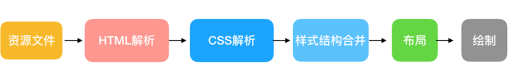
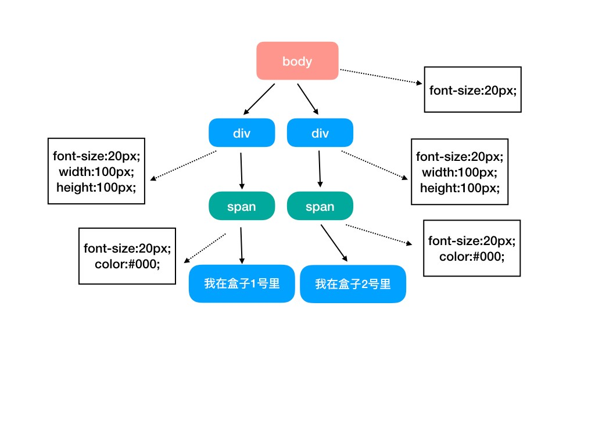

# 渲染引擎原理

上节介绍的渲染引擎的重要性，这一节深入剖析

> 这块知识非常容易出问答题/作为性能优化面试题的切入点

### 流程解析

上节我们学到，渲染引擎可以把**静态资源**转换为**可视化界面**

那么是如何转换呢？其实是有具体步骤的：

整体来看，这五个过程分别完成了以下任务：

**1. HTML 解析**

浏览器对 HTML 文档进行解析，并且请求需要的外部资源，如图片，css，js

**2. CSS 解析**

浏览器将识别并加载所有的 CSS 样式信息。

**3. 样式与结构合并**

将样式信息和文档结构合并，最终生成页面 render 树

:after :before 这样的伪元素会在这个环节被构建到 DOM 树中

**4. 布局阶段**

页面中所有元素的相对位置信息，大小等信息均在这一步得到计算

比如：offsetLeft，offsetWidth

**5. 页面绘制**

将前几步的处理结果转换为像素，进行文件解码

### 阶段性产物

**1. DOM 树**

将 html 结构层层解析为最小单位 - 节点

**2. CSSOM 树**

将 css 解析成 CSSOM 树。没错，CSSOM 也是树形结构

注意的点：css 样式会从最通用规则开始匹配（比如全局修饰 P 标签，那么全部 p 标签都会应用），同时会从最顶层父元素开始继承样式，一层一层递归细化出具体样式。

**3. 渲染树**

DOM 树和 CSSOM 树解析完毕后，它们会立马合体，组成 Render Tree（渲染树）

渲染树只会渲染可见节点。步骤如下：

1. 根节点开始遍历，筛选出所有可见的节点；
2. 仅针对可见节点，为其匹配 CSSOM 中的 CSS 规则
3. 发射可见节点（连同其内容和计算的样式）

**4. 布局盒子模型**

上一步合成了渲染树，而这一步，我们需要遍历渲染树，计算出每个节点的具体大小和相对浏览器视口的具体位置

没错，这一步只是计算。计算后的信息写回渲染树，就形成了“布局渲染树”。

**5. 目标界面**

上面的 4 步都是在内存中进行的，计算好了需要绘制界面的所有信息，可以说是万事俱备，只欠东风了。

这一步，就是把渲染树上的每一个节点绘制成像素，将页面呈现出来。
