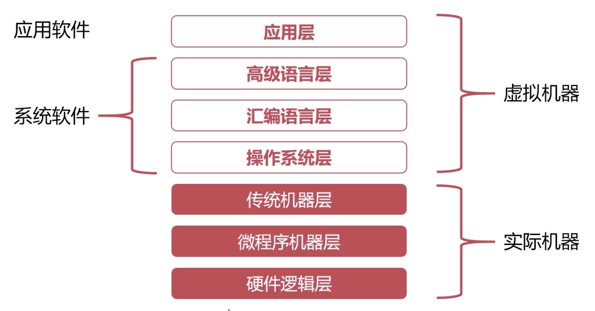
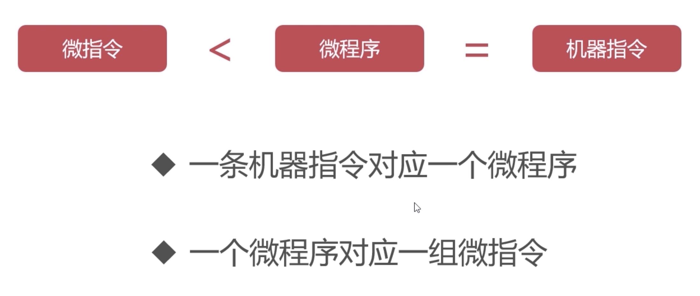

# 程序翻译与程序解释

翻译与解释，是为了将计算机语言和人类语言进行转换

### 程序翻译

高级语言通过 `编译器`直接翻译成计算机可执行的低级语言

语言：C/C++，Object-c，Golang

### 程序解析

低级语言实现一个 `解释器`，将高级语言作为输入，逐行翻译为低级语言

语言：Python，Php，Javascript

#### 特殊语言

Java 和 C# 是 `翻译+解释`型语言

java 程序->[编译]->JVM 字节码->[解释]->机器码

### 计算机的层次

共七个层次，计算机主要研究上四层

#### 硬件逻辑层

- 门，触发器等逻辑电路组成
- 属于电子工程领域

#### 微程序机器层

- 编程语言是微指令集
- 微指令所组成的微程序直接由硬件执行

#### 传统机器层

- 编程语言是 CPU 指令集（机器指令）
- 编程语言和硬件直接相关
- 不同架构的 CPU 使用不同的 CPU 指令集

#### 操作系统层

- 向上提供简易的操作界面
- 向下对接指令系统，管理硬件资源
- 软件和硬件的适配层

#### 汇编语言层

- 语言是汇编语言
- 汇编语言可翻译成直接执行的机器语言
- 执行翻译的程序是汇编器

#### 高级语言层

- 广大程序员使用的语言

#### 应用层

- 计算机应用，如 word，ppt，excl
