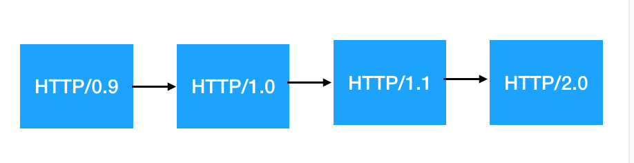

# HTTP 大揭秘

相比于 TCP，HTTP 在日常开发中更需要我们扎实的掌握。

需要着重掌握三个方面的考点：

- HTTP 请求方法；
- HTTP 状态码；
- 对**无状态**的理解。

除此之外，还有 HTTP 不同阶段的特性。

### HTTP 通用考点梳理

#### HTTP 状态码

响应分为五类：

- 信息响应(100–199)，
- 成功响应(200–299)，
- 重定向(300–399)，
- 客户端错误(400–499)，
- 服务器错误 (500–599)

常用响应状态如下：

- **1xx**：需要客户端继续请求。

- **2xx**：成功接收请求、且已处理完毕。
  -- 200：OK，表示正常响应
  -- 201：Created，请求成功，并创建了一个新的资源
  -- 202：Accepted，请求成功，服务器正在处理（异步任务）
  -- 206：Partical Content，处理部分 get 请求，断点续传和分块下载时的状态。

- **3xx**：重定向。
  -- 301：永久性重定向，表示资源已被分配了新的 URL
  -- 302：临时性重定向，资源临时被分配了新的 URL
  -- 304：返回缓存的资源

- **4xx**：客户端错误
  -- 400：Bad Request，常指参数错误
  -- 401：Unauthorized，身份验证失败，token 失效
  -- 403：Forbidden，服务器拒绝（多半是没权限）
  -- 404：Not Found，资源不存在
  -- 405：Method Not Allowed，请求方法错误
  -- 408：Request Timeout：请求超时
  -- 413：Payload Too Large：请求资源太大，拒绝处理（文件上传）

- **5xx**：服务器错误
  -- 500：服务器内部错误
  -- 502：Bad Gateway，网关错误
  -- 504：Gateway Timeout，网关超时

> 网关：转发其他服务器通信数据的服务器

#### HTTP 请求方法

- **GET**：数据读取，参数为 query 形式
- **POST**：创建/修改资源，参数为 body 形式
- **HEAD**：只获取响应头信息
- **PUT**：修改某个具体资源
- **DELETE**：删除指定的资源
- **OPTIONS**：获取服务器支持的通信选项

#### 高频考点——对“无状态”的理解

HTTP 协议是无状态的。

“无状态”可以理解为”无记忆“。即前一个 A 请求和后一个 B 请求完全无关联，互相独立。

如果想维护状态信息怎么办？两个思路：**cookie** 和 **session**。

- **cookie**：存储在浏览器的小段文本，请求时会发到服务器上。
- **session**：存储在服务器的数据。服务器创建一个 session 时，会将 session-id 写入 cookie 中。后面再从请求的 cookie 中解析出 session-id，进而找到这个 session。

##### cookie

一系列的键值对。形式为 name=value，中间用分号和空格分割。

```sh
Cookie: PHPSESSID=298zf09hf012fh2; csrftoken=u32t4o3tb3gg43;
```

### HTTP 的发展史

http 不是一成不变的，它一直在发展进化。截止到 2.0 过程如下：



0.9 版本年代太过久远，这里不讨论。就从 1.0 开始说起：

#### HTTP1.1 解决的问题

首先，要知道 HTTP1.0 的痛点：

##### 1. TCP 连接不可复用

每通信一次，都需要“三步走” —— TCP 连接、HTTP 通信、断开 TCP 连接：


当通信频率非常高时，这样每次三步走会很消耗资源。

HTTP1.1 解决了这个问题，效果如图：


这样在一个 TCP 连接里可以进行多次 HTTP 通信的机制，就是 —— **长连接**。

##### 2. 队头阻塞问题

HTTP/1.0 中，请求是串行的。即一个个请求必须按顺序处理。

这样的问题是：如果一个请求堵塞，后面的请求会一直等待。

HTTP/1.1 解决方案：**管线化**。即允许多个 HTTP 请求批量提交到服务器。

不过这个方案并未真正解决问题。因为服务器还是要安顺序响应，也就是说响应仍是串行的，还是会堵塞。

#### HTTP2.0 对性能的改进

改进性能是 HTTP2.0 的核心目标。看看它作出的努力：

##### 1. 二进制分帧

HTTP1.x 中，数据直接以文本传递。

HTTP2.0 会将消息划分为**消息**和**帧**，并用二进制编码，确保高效解析。

##### 2. 头部压缩

HTTP2.0 中，客户端和服务器会分别维护一份相同的头部静态 数据，和一份不同的动态数据。

当发生通信时，不同的请求头会被写入动态数据。后面的请求只携带这份不同的请求头，其他头部信息从静态数据中获取。

相对于 HTTP1.x 中每次都要携带整个头部跑来跑去的笨重操作来说，大大节省了网络开销。

##### 3. 服务端推送

在 HTTP1.x 中，如果资源 A 依赖 资源 B，那么请求 资源 A 时必须要先请求资源 B。

而 HTTP2.0 中，允许服务器主动向客户端 push 资源。即当客户端忘记请求资源 B 时，服务器可以主动将它推送给客户端。

##### 4. 多路复用

上面说到，HTTP1.1 并未真正解决队头阻塞问题。

到了 HTTP2.0，终于有了解决方案，就是多路复用。

**多路复用其实就是进化版的长连接**。

在 HTTP 2.0 多路复用下，请求之前互相独立，完全实现了并行请求，并行响应，彻底解决了队头阻塞问题。
