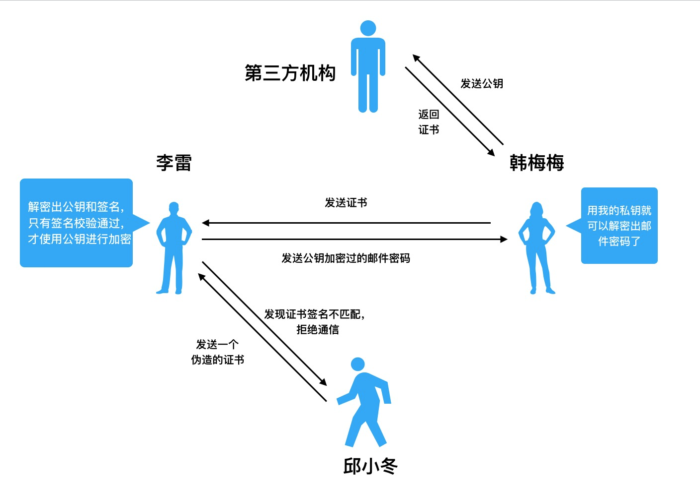

# 理解 HTTPS

HTTPS 其实是多了一个颁发证书的第三方机构

x
### 明文传输

客户端和服务器直接通信，无加密，就叫明文传输。

缺点：请求/响应被拦截到，就可直接拿到信息。

### 对称加密

对信息做加密和解密，中间传递的是一个加密后的信息。

特点：加密和解密用的同一个密码。

这个密码，就是”公钥“。

### 非对称加密

即”公钥+私钥“的加密组合。

公钥和私钥是**多对一**的关系，公钥加密的内容，只有私钥可以解开，私钥加密的内容，所有的公钥都可以解密

两种加密方式：

1. 公钥加密/私钥解密：防止密文被破解，保证信息安全
2. 私钥加密/公钥解密：数字签名，确保正确的发送方

通常会将**对称加密**和**非对称加密**结合使用。先用非对称加密确保公钥（密码）的安全，再用安全的公钥（邮件密码）来进行对称加密。

不过还是无法彻底规避伪造公钥的情况，还需要第三方认证。

### 第三方认证

第三方机构，叫做 CA（Certificate Authority），它的作用就是颁发证书。

在 https 中，颁发证书的必须是权威可靠的第三方机构。因为证书谁都可以生成，权威机构经过审核颁发的证书，能够证明持有者身份的可靠性。

证书中包含的主要信息有：

- 域名
- 公司信息
- 序列号
- 签名信息

客户端利用 CA 提供的公钥，解析证书，获取到两个东西：

- 证书签名
- 服务器公钥

签名用于校验身份。如果校验通过，就可以用服务器公钥进行通信了。
