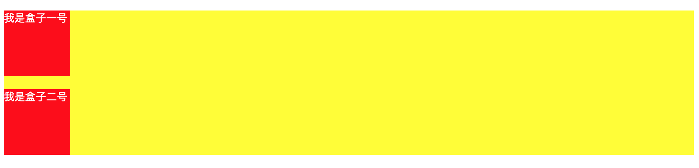
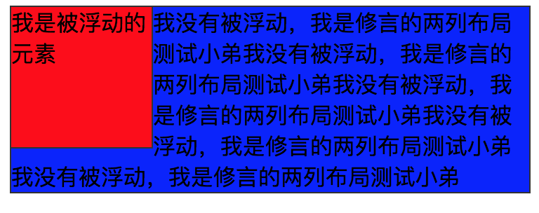
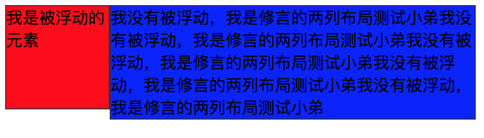

# BFC 揭秘

块格式化上下文（Block Formatting Context）简称 BFC。

BFC 就是一个作用范围。可以把它理解成是一个独立的容器。

不过这个定义比较抽象。理解 BFC 能解决什么问题、能够用于什么场景，更直观。

### 业务场景

BFC 常用来解决以下的布局问题：

* 清除浮动 bug；
* 阻止 margin 发生重叠；
* 两列布局浮动问题。

先列举几个常见的创建 BFC 的方法：

* float 的值不是 none；
* position 的值不是 static 或者 relative；
* overflow 的值不是 visible。

#### BFC 清除浮动

在 flex 盛行之前，实现块元素横向排列的首选方案就是浮动布局。

但是浮动布局有个副作用：因为脱离文档流，所以父元素不会被撑开。

怎么办呢？这里可以设置 overflow 属性：

```css
overflow: hidden;
```

此时父元素创建了一个 BFC，使父元素成为独立区域，“包裹”住他所有的子元素，间接实现了撑开父元素。

#### BFC 解决重叠边距问题

先来看看啥是外边距重叠：

```html
<div class="box">
   <div class="box1">我是盒子一号</div>
   <div class="box2">我是盒子二号</div>
</div>
```

```css
.box {
   background-color: yellow;
}
.box1,
.box2 {
   padding: 0;
   width: 100px;
   height: 100px;
   margin: 20px 0 20px 0;
   background-color: red;
   color: #fff;
}
```

效果如下：



其实这里出现了两个问题：

1. 兄弟元素之间边距重叠
2. 子元素边距溢出到了父元素外面

此时，BFC 上场了。给两个盒子各创建一个父元素，都设置为 BFC，问题就解决了.

```html
<div class="box">
  <div class="box-container">
     <div class="box1">我是盒子一号</div>
  </div>
  <div class="box-container">
     <div class="box2">我是盒子二号</div>
  </div>
</div>
<style>
  .box-container {
     overflow: hidden;
  }
</style>
```

此时的 **.box-container** 是一个独立区域，“封锁” 了边距重叠，既不让 margin 影响相邻的兄弟元素，也不影响父元素。

再想一种情况：如果不加 **.box-container**，而是将父元素 **.box** 设置为 BFC 呢？

这时候父子元素的边界溢出解决了，兄弟元素的边界重叠还是存在的。

#### 阻止元素被浮动的元素覆盖

基于浮动可以实现两列布局：一列宽度固定，另一列自适应。

```html
<body>
    <div class="floatBox1">我是被浮动的元素</div>
    <div class="box2">
        我没有被浮动，我是修言的两列布局测试小弟我没有被浮动，我是修言的两列布局测试小弟我没有被浮动，我是修言的两列布局测试小弟我没有被浮动，我是修言的两列布局测试小弟我没有被浮动，我是修言的两列布局测试小弟</div>
</body>
```

```css
.floatBox1 {
   width: 100px;
   height: 100px;
   float: left;
   border: 1px solid #333;
   background: red;
}

.box2 {
   height:100%;
   border: 1px solid #333;
   background: blue;
}
```

效果是这样的：



左侧盒子使用了浮动布局，会脱离文档流，“浮”在普通文档流的上方。

但我们要的是分割的两列，怎么办呢?

方案就是要 **.box2** 独立，不受浮动影响，将它设置为 BFC 嘛：

```css
.box2 {
   overflow: hidden;
}
```

最终效果：



查看源码：[两列浮动布局](https://codesandbox.io/s/liangliefudongbuju-1uxrc?file=/index.html)
