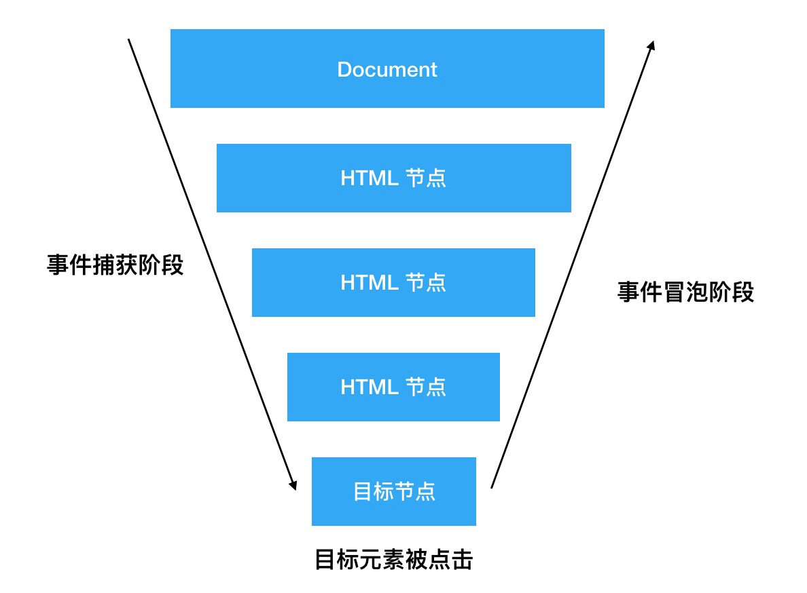

# 事件体系

DOM 事件体系相关的基本功，包含以下几个方面：

* DOM 事件流
* 事件对象
* 事件代理
* 自定义事件

### DOM 事件流

事件流描述的是事件在页面中传播的顺序

一个事件的传播过程要经过以下三个阶段：

1. 事件捕获阶段
2. 目标阶段
3. 事件冒泡阶段



流程是：事件被触发后，会从最外层的元素开始穿梭，直到目标节点，这个过程是事件捕获；元素被点击后，事件继续向上触发，这个过程叫事件冒泡。

整个过程是个V字形。


### 事件对象基础

事件处理函数被触发时，会产生一个 event 参数，包含事件和dom相关信息

event 对象有很多非常常用的属性，这里介绍一下：

**1. currentTarget**

表示事件当前正在被哪个元素接收，这个元素是一直在改变的。

**2. target**

真正的目标元素，事件来源

> 这两个属性，是我们实现事件代理的好帮手

**3. preventDefault**

阻止默认行为，如 a 标签的跳转等

```javascript
e.preventDefault();
```

**4. stopPropagation**

终止事件继续冒泡或捕获

```javascript
e.stopPropagation()
```

这个事件最常用，阻止触发父元素的事件

### 事件对象，是可以手动创建的

除了触发元素的某个具体事件来产生事件对象，也可以手动创建。

方法： Event() 构造函数

```javascript
var event = new Event(typeArg, eventInit);
```

事件对象的这个特性，是我们创建自定义事件的基础

### 自定义事件

上面讲到的所有事件，都是浏览器对输入行为的感知。比如点击鼠标，按下键盘。

那有没有除了鼠标和键盘等不属于浏览器自带的其他事件呢？

答案是有，它就是自定义事件。

这里的自定义事件，**和 Vue 中的自定义事件，如出一辙**

首先，创建一个事件：

```javascript
var cusEvent = new Event('cusEv');
```

第二步，绑定事件：

```javascript
// 获取 divB 元素 
var divB = document.getElementById('divB')
// divB 监听 clickA 事件
divB.addEventListener('cusEv',function(e){
  console.log('自定义事件触发了')
  console.log(e.target)
}) 
```

第三步，触发事件：

```javascript
divB.dispatchEvent(cusEvent)
```

### 事件代理

事件代理，又叫事件委托

需求：点击任何一个li，打印 li 中的文字

```html
<ul id="poem">
    <li>鹅鹅鹅</li>
    <li>曲项向天歌</li>
    <li>白毛浮绿水</li>
    <li>红掌拨清波</li>
</ul>
```

如果给每个 li 都添加点击事件，开销太大，也不合理

正确的做法是什么呢？

因为存在事件冒泡，所以如果直接监听 ul 的点击事件，是不是比监听每个 li 的事件更高效呢？

这种用 li 的父元素“代替”监听 li 的点击事件，就叫做事件代理。

正确姿势的 code：

```javascript
var ul = document.getElementById('poem')
ul.addEventListener('click', function(e){
  console.log(e.target.innerHTML)
}) //e.target指向目标li
```