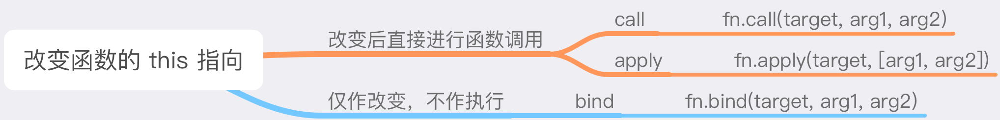

# 07 this指向

多数情况下，this 指向调用它所在`方法`的那个`对象`。

解释：谁调的函数，this 就指向谁。如果没有指定谁调用，就指向全局对象。严格模式下指向`undefined`

> `this`是在调用时决定的；`闭包`是在书写时决定的。

### 指向原则

不管方法被书写在哪个位置，它的 this 只会跟着它的调用方走

### 特殊情境

好消息！在三种特殊的函数中，无论是否是严格模式，this 会 100% 指向 window：

- 立即执行函数（IIFE）
- setTimeout 中传入的函数
- setInterval 中传入的函数

setTimeout 和 setInterval 以及里面的函数，都会首先被交付到全局对象手上

#### 构造函数情况

构造函数里面的 this 会绑定到我们 new 出来的这个对象上


## 严格模式

严格模式下的情况稍有不同。

#### 普通函数中

普通函数是指 *函数声明* 或者 *函数表达式*，不包括箭头函数。

在非严格模式下，this 会指向全局变量（window 或 global）

严格模式下，如果没有指定对象，this 就是 undefined

```js
'use strict'

function commonFn() {
  console.log(this)
}
commonFn() // undefined
window.commonFn(); // window
```

#### 全局代码中

即在 `全局作用域` 下执行的函数或代码段里的 this。

不管它是否处于严格模式下，它的 this 都指向全局变量。

```js
'use strict'

console.log(this); // window

setTimeout(function () {
  console.log(this); // window
});
```

经过试验，所有的高阶函数中，this 指向的都是全局对象。

如：`Array.prototype.map`，`Array.prototype.filter`，`Array.prototype.reduce`，

## 箭头函数

箭头函数是 es6 提供的新的函数形式，和普通函数的区别有这些：

- 无视严格模式
- 类似闭包，认词法作用域

箭头函数的 this 会在书写阶段（即声明位置）就绑定到它父作用域的 this 上

## 改变 this 指向

改变 this 指向的三个方法：

`call`，`apply`，`bind`



举例：

```js
var obj = 'ruims'

function commonfn() {
  console.log(this)
}

commonfn() // window
commonfn.call(obj) // 'ruims'
```

#### 三个方法的模拟

首先屡一下这三个方法的共同点。

- 任何函数都能执行的，所以要绑定在 Function.prototype 上
- 改变 this 的指向
- 根据输入的参数，执行函数

call/apply的核心实现原理是：

- 第一个参数 context 添加一个属性 func，赋值为 this
- 调用 context.func
- 删除 context.func

**call 方法模拟**

```javascript
Function.prototype.myCall = function (context, ...args) {
  // ...args是rest参数，表示剩余参数，args是剩余参数数组
  args = args || [];
  // step1: 把函数挂到目标对象上（这里的 this 就是我们要改造的的那个函数）
  context.func = this;
  // step2: 执行函数
  context.func(...args);
  // step3: 执行完成删除
  delete context.func;
};
```

apply 方法模拟并且有返回

```javascript
Function.prototype.myApply = function (context, args) {
  args = args || [];
  context.func = this;
  var res = context.func(...args);
  delete context.func;
  return res;
};
```

**bind 方法模拟**

> bind 与 apply/call 一样都能改变函数 this 指向，但 bind 并不会立即执行函数，而是返回一个绑定了 this 的新函数，

在调用 bind 时可以先传递部分参数，在调用返回的 bound 时可以补全剩余参数。

```js
Function.prototype.myBind = function (context, ...args) {
  var self = this;
  // args 等于 [].slice.call(arguments, 1);
  args = args || [];
  var bound = function (...params) {
    return self.apply(context, args.concat(params));
  };
  return bound;
};
```
