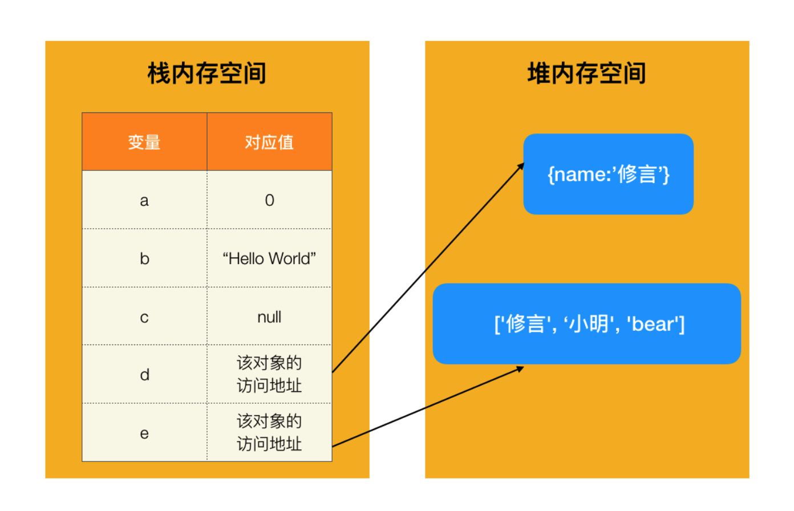
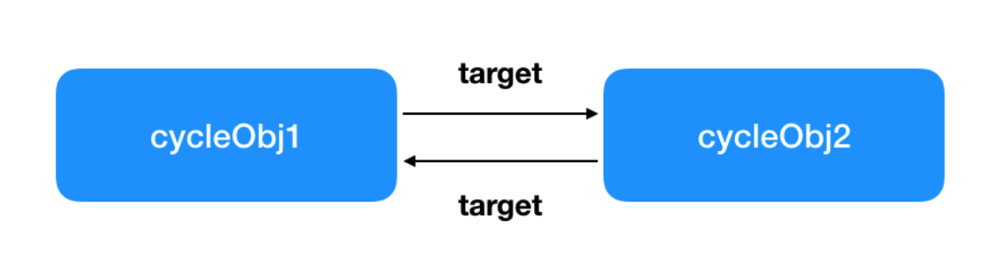

## 内存管理机制

js 内存管理的知识，主要从三个方面来看。

1. 内存分类
2. 垃圾回收机制
3. 内存泄漏相关

### 内存生命周期

内存管理是每种编程语言的基本能力，区别是有的语言会开放 api，有的语言则不会，比如 js。js 是通过自己的`垃圾回收机制`自动管理内存的

### 三个阶段


1. 挖坑 — 分配内存
2. 用坑 - 内存的读与写
3. 还坑 = 内存释放

“坑” 也是不同的，分两种，下面介绍 👇

### 栈内存与堆内存

JS 中的数据类型有两类：`基本类型`和`引用类型`。

基本类型包括：String、Number、Boolean、null、undefined、Symbol，存储于栈内存

引用类型包括：Object、Array、Function，Date，存储于堆内存

> 堆和栈分别是不同的数据结构。栈是线性表的一种，而堆则是树形结构。



在访问 a、b、c 三个变量时，从栈中直接获取该变量的值；

访问 d 和 e 时，需要分两步走：

- 从栈中获取变量对应值的引用（堆内存中的地址）
- 用上一步获取到的引用，再去堆内存找到数据

## 垃圾回收机制

垃圾回收是指，当一个变量不再被需要之后，自动释放掉所占用的内存空间

判断依据 - 垃圾回收算法！

下面介绍两种算法 👇

### 引用计数法

引用：一个对象如果有权访问另一个对象（隐式或者显式），就叫做引用另一个对象。例如，一个 Javascript 对象具有对它原型的引用（隐式引用）和对它属性的引用（显式引用）

> 谁能访问，谁引用

声明一个变量等于创建一个引用。

给对象中添加一个引用计数器，每当有一个地方引用它时，计数器的值就加 1；当引用失效时，计数器值就减 1；

**当引用为 0 时，变量所占用的内存空间会被释放掉；**

#### 循环引用

引用计数法已被现代浏览器淘汰，原因之一是在循环引用下，引用永远无法为 0，内存不会释放，容易造成`内存泄漏`



```javascript
var cycleObj1 = {};
var cycleObj2 = {};
cycleObj1.target = cycleObj2;
cycleObj2.target = cycleObj1;
```

### 标记清除法

该算法的判断标准，是变量`是否可抵达`！

两个阶段：

- 标记阶段：从根对象（Window 或 Global）开始扫描，可用变量标记为`可抵达`
- 清除阶段：发现没有被标记为 “可抵达” 的变量，一键清除

## 闭包与内存泄漏

内存泄漏：不使用的变量（内存垃圾）没有被释放，导致内存占用攀升

### 内存泄漏成因

#### 1. 全局变量

非严格模式下，me 而非 var me 这种写法，会使 me 挂载到全局

```js
function test() {
  me = "xiuyan";
}
```

#### 2. 计（延）时器

setInterval 和 setTimeout 链式调用，未清除的话，会导致内存泄漏

```js
setInterval(function () {
  // 函数体
}, 1000);

setTimeout(function () {
  // 函数体
  setTimeout(arguments.callee, 1000);
}, 1000);
```
