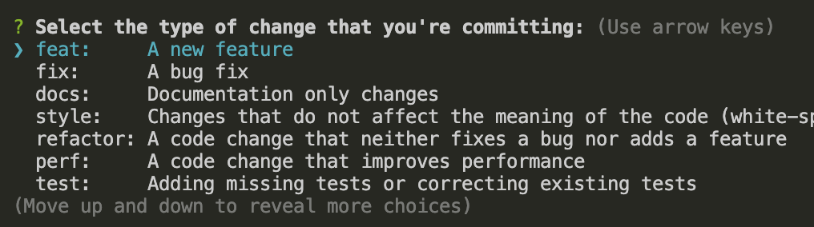

# git 架构技能

本文从前端工程，团队协作，生产部署的角度，介绍架构人员需要掌握的 git 实践能力。

## 大纲预览

本文介绍的内容包括以下方面：

- 分支管理策略
- commit 规范与提交验证
- 误操作的撤回方案
- Tag 与生产环境
- 永久杜绝 443 Timeout
- hook 实现部署？
- 终极应用: CI/CD

## 分支管理策略

git 分支强大的同时也非常灵活，如果没有一个好的分支管理策略，团队人员随意合并推送，就会造成分支混乱，各种覆盖，冲突，丢失等问题。

目前最流行的分支管理策略，也称工作流（Workflow），主要包含三种：

- Git Flow
- GitHub Flow
- GitLab Flow

我司前端团队结合实际情况，制定出自己的一套分支管理策略。

我们将分支分为 4 个大类：

- dev-\*
- develop
- staging
- release

`dev-*` 是一组开发分支的统称，包括个人分支，模块分支，修复分支等，团队开发人员在这组分支上进行开发。

开发前，先通过 `merge` 合并 develop 分支的最新代码；开发完成后，必须通过 `cherry-pick` 合并回 `develop` 分支。

`develop` 是一个单独分支，对应开发环境，保留最新的完整的开发代码。它只接受 `cherry-pick` 的合并，不允许使用 merge。

`staging` 分支对应测试环境。当 develop 分支有更新并且准备发布测试时，staging 要通过 `rebase` 合并 develop 分支，然后将最新代码发布到测试服务器，供测试人员测试。

测试发现问题后，再走 **dev-\* -> develop -> staging** 的流程，直到测试通过。

测试通过后，`release` 分支通过 `rebase` 合并 staging 分支，然后将最新代码发布到生产服务器。

总结下合并规则：

- develop -> (merge) -> dev-\*
- dev-\* -> (cherry-pick) -> develop
- develop -> (rebase) -> staging
- staging -> (rebase) -> release

#### 为什么合并到 develop 必须用 cherry-pick？

使用 merge 合并，如果有冲突，会产生分叉；`dev-*` 分支多而杂，直接 merge 到 develop 会产生错综复杂的分叉，难以理清提交进度。

而 cherry-pick 只将需要的 commit 合并到 develop 分支上，且不会产生分叉，使 git 提交图谱（git graph）永远保持一条直线。

再有，模块开发分支完成后，需要将多个 commit 合为一个 commit，再合并到 develop 分支，避免了多余的 commit，这也是不用 merge 的原因之一。

#### 为什么合并到 staging/release 必须用 rebase？

release 译为变基，合并同样不会产生分叉。当 develop 更新了许多功能，要合并到 staging 测试，不可能用 cherry-pick 一个一个把 commit 合并过去。因此要通过 rebase 一次性合并过去，并且保证了 staging 与 develop 完全同步。

release 也一样，测试通过后，用 rebase 一次性将 staging 合并过去，同样保证了 staging 与 release 完全同步。

## commit 规范与提交验证

commit 规范是指 git commit 时填写的描述信息，要符合统一规范。

试想，如果团队成员的 commit 是随意填写的，在协作开发和 review 代码时，其他人根本不知道这个 commit 是完成了什么功能，或是修复了什么 Bug，很难把控进度。

为了直观的看出 commit 的更新内容，开发者社区诞生了一种规范，将 commit 按照功能划分，加一些固定前缀，比如 `fix:`，`feat:`，用来标记这个 commit 主要做了什么事情。

目前主流的前缀包括以下部分：

- `build`：表示构建，发布版本可用这个
- `ci`：更新 CI/CD 等自动化配置
- `chore`：杂项，其他更改
- `docs`：更新文档
- `feat`：常用，表示新增功能
- `fix`：常用：表示修复 bug
- `perf`：性能优化
- `refactor`：重构
- `revert`：代码回滚
- `style`：样式更改
- `test`：单元测试更改

这些前缀每次提交都要写，刚开始很多人还是记不住的。这里推荐一个非常好用的工具，可以自动生成前缀。地址在[这里](https://github.com/commitizen/cz-conventional-changelog)

首先全局安装：

```sh
npm install -g commitizen cz-conventional-changelog
```

创建 `~/.czrc` 文件，写入如下内容：

```js
{ "path": "cz-conventional-changelog" }
```

现在可以用 `git cz` 命令来代替 `git commit` 命令，效果如下：



然后上下箭选择前缀，根据提示即可方便的创建符合规范的提交。

有了规范之后，光靠人的自觉遵守是不行的，还要在流程上对提交信息进行校验。

这个时候，我们要用到一个新东西 —— `git hook`，也就是 git 钩子。

git hook 的作用是在 git 动作发生前后触发自定义脚本。这些动作包括提交，合并，推送等，我们可以利用这些钩子在 git 流程的各个环节实现自己的业务逻辑。

git hook 分为客户端 hook 和服务端 hook。

客户端 hook 主要有四个：

- `pre-commit`：提交信息前运行，可检查暂存区的代码
- `prepare-commit-msg`：不常用
- `commit-msg`：非常重要，检查提交信息就用这个钩子
- `post-commit`：提交完成后运行

服务端 hook 包括：

- `pre-receive`：非常重要，推送前的各种检查都在这
- `post-receive`：不常用
- `update`：不常用

大多数团队是在客户端做校验，所以我们用 `commit-msg` 钩子在客户端对 commit 信息做校验。

幸运的是，不需要我们手动去写校验逻辑，社区有成熟的方案：`husky + commitlint`

husky 是创建 git 客户端钩子的神器，commitlint 是校验 commit 信息是否符合上述规范。两者配合，可以阻止创建不符合 commit 规范的提交，从源头保证提交的规范。

## 误操作的撤回方案

开发中频繁使用 git 拉取推送代码，难免会有误操作。这个时候不要慌，git 支持绝大多数场景的撤回方案，我们来总结一下。

撤回主要是两个命令：`reset` 和 `revert`

### git reset

reset 命令的原理是根据 `commitId` 来恢复版本。因为每次提交都会生成一个 commitId，所以说 reset 可以帮你恢复到历史的任何一个版本。

> 这里的版本和提交是一个意思，一个 commitId 就是一个版本

reset 命令格式如下：

```sh
$ get reset [option] [commitId]
```

比如，要撤回到某一次提交，命令是这样：

```sh
$ get reset --hard cc7b5be
```

上面的命令，commitId 是如何获取的？很简单，用 `git log` 命令查看提交记录，可以看到 commitId 值，这个值很长，我们取前 7 位即可。

这里的 option 用的是 `--hard`，其实共有 3 个值，具体含义如下：

- `--hard`：撤销 commit，撤销 add，删除工作区改动代码
- `--mixed`：默认参数。撤销 commit，撤销 add，还原工作区改动代码
- `--soft`：撤销 commit，不撤销 add，还原工作区改动代码

这里要格外注意 `--hard`，使用这个参数恢复会删除工作区代码。也就是说，如果你的项目中有未提交的代码，使用该参数会直接删除掉，不可恢复，慎重啊！

除了使用 commitId 恢复，git reset 还提供了恢复到上一次提交的快捷方式：

```sh
$ git reset --soft HEAD^
```

`HEAD^` 表示上一个提交，可多次使用。

其实平日开发中最多的误操作是这样：刚刚提交完，突然发现了问题，比如提交信息没写好，或者代码更改有遗漏，这时需要撤回到上次提交，修改代码，然后重新提交。

这个流程大致是这样的：

```sh
# 1. 回退到上次提交
$ git reset HEAD^
# 2. 修改代码...
# 3. 加入暂存并重新提交
$ git add .
$ git commit -m 'fix: ***'
```

针对这个流程，git 还提供了一个更便捷的方法：

```sh
$ git commit --amend
```

这个命令会直接修改当前的提交信息。如果代码有更改，先执行 `git add`，然后再执行这个命令，比上述的流程更快捷更方便。

reset 还有一个非常重要的特性，就是**真正的后退一个版本**。

什么意思呢？比如说当前提交，你已经推送到了远程仓库；现在你用 reset 撤回了一次提交，此时本地 git 仓库要落后于远程仓库一个版本。此时你再 push，远程仓库会拒绝，要求你先 pull。

如果你需要远程仓库也后退版本，就需要 `-f` 参数，强制推送，这时本地代码会覆盖远程代码。

注意，`-f` 参数非常危险！如果你对 git 原理和命令行不是非常熟悉，切记不要用这个参数。

那撤回上一个版本的代码，怎么同步到远程更安全呢？

方案就是下面要说的第二个命令：`git revert`

### git revert

revert 与 reset 的作用一样，都是恢复版本，但是它们两的实现方式不同。

简单来说，reset 直接恢复到上一个提交，工作区代码自然也是上一个提交的代码；而 revert 是新增一个提交，但是这个提交是使用上一个提交的代码。

因此，它们两恢复后的代码是一致的，区别是一个新增提交（revert），一个回退提交（reset）。

正因为 revert 永远是在新增提交，因此本地仓库版本永远不可能落后于远程仓库，可以直接推送到远程仓库，故而解决了 reset 后推送需要加 `-f` 参数的问题，提高了安全性。

说完了原理，我们再看一下使用方法：

```sh
$ git revert -n [commitId]
```

掌握了原理使用就很简单，只要一个 commitId 就可以了。

## Tag 与生产环境

git 支持对于历史的某个提交，打一个 tag 标签，常用于标识重要的版本更新。
