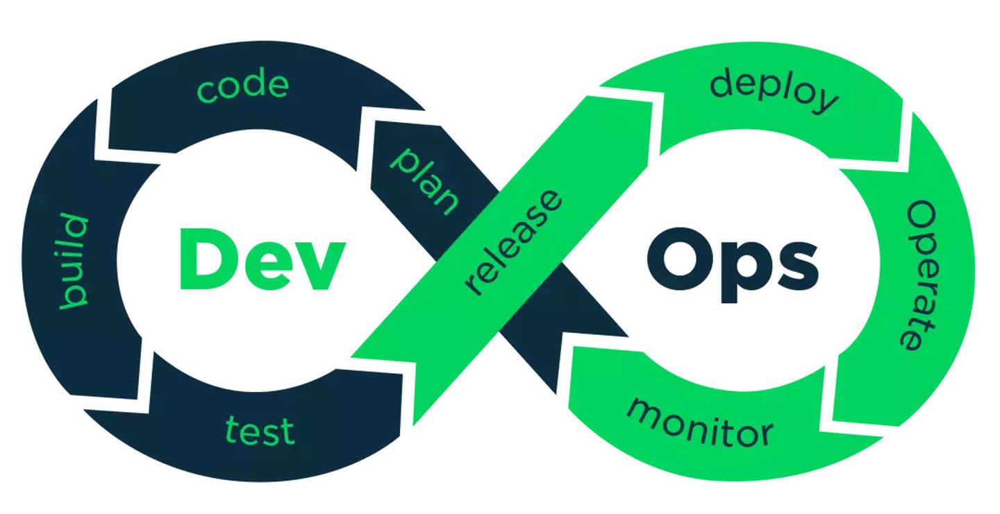

# 认识 DevOps

近年来，DevOps 在我们的视野中出现的频率越来越高了。

好多人都知道有 DevOps 这个东西，但它具体是个啥，甚至这个词怎么读，可能多数人都不清楚。

DevOps 的英文发音是 `/de'vɒps/`，其实就是 Development（开发） 和 Operations（运维） 两个词的组合。

正如它的名字，DevOps 生来的使命，就是打通 **开发** 和 **运维**。

<!-- 所谓的 DevOps 平台，是否等同于自动化运维平台，或持续交付平台呢？ -->

为什么打通开发和运维如此重要？这要从软件工程的三个阶段说起。

### 三个阶段

软件工程发展至今，大致经历了三个阶段，三种模式。

**瀑布开发模式**

瀑布模式的特点是，**需求，开发，测试，运维**这几个阶段，必须一个阶段**全部完成**了，才进行下一阶段。如果中间某个环节出了问题，就会直接影响下一阶段，甚至要推倒重来。

最常见的情况是，前期需求没有做明确，然后交给了开发。当开发费了老大力气做出功能，产品又说与业务实际情况不符，要推倒重来。这也是开发和产品经常互掐的原因。

瀑布模式要求每个阶段都必须严谨，符合交付标准，不能疏漏。然而随着现代应用程序的复杂度越来越大，尤其是前期对市场和用户了解最少的时候，做出的需求决策往往有很大的不确定性。

当需求变动，则牵动后面的整个流程，直接的后果就是交付延期。

**敏捷开发模式**
