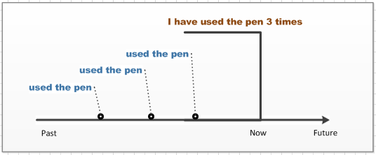
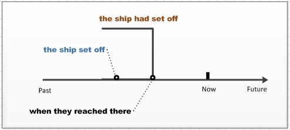
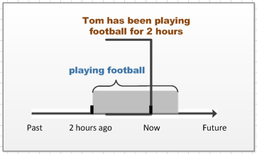

# 完成时总纲

完成时的语法，总结下就 3 类：

- had done
- have done
- have been doing

完成时表示的都是**站在某一时间点，并对这个时间点之前发生动作做一个总结**。

### 现在完成时（have done）

处于现在这个时间点，对之前发生的一个或一系列动作的总结。

如：I `have used` the pen only three times.

（这支笔我只用过三次）

用过 3 次，表示到目前为止，已经用过了 3 次。用图表示：

### 过去完成时（had done）

站在某个**过去的时间点**，对之前发生的一个或一系列动作的总结。

如：When they reached there, the ship `had set` off.

（当他们到达那里的时候，船已经开了）

这里用到 `reached`，表示是过去发生的事，这是与现在完成区分的关键。

### 现在完成进行时（have been doing）

对一个**现在**正在进行动作的总结。

如：Tom has been playing football for two hours.

（Tom 已经踢了两个小时的足球了）

如图：用“灰色矩形”来表示进行的动作。到现在为止动作还没结束。

只不过是站在现在这个时间点，对已经进行完的动作做总结。

