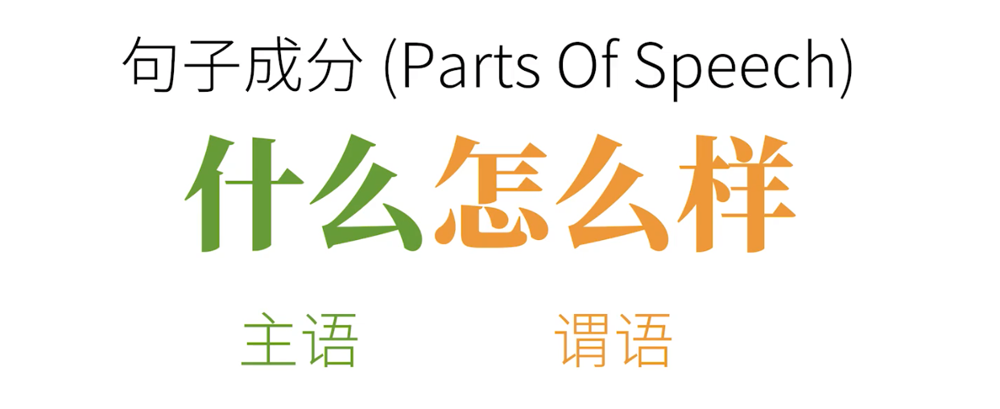
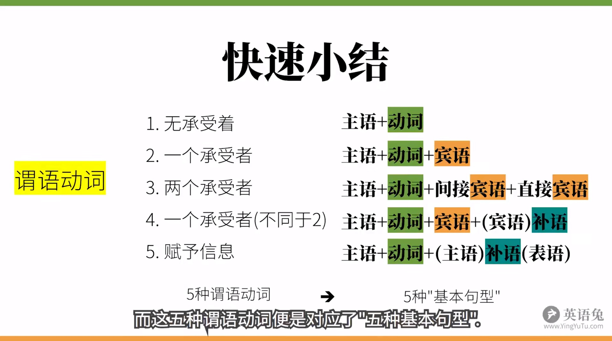

# 语法体系

语法，说白了就是句子成分。

几乎所有的英语句子，都是 **主语+谓语** 的结构

- 主语：人或物
- 谓语：发生了什么事（动作）

谓语的核心是动词，下面看看有哪些动词。

## 动词分类

**1.** 可独立完成的动作：不及物动词

> 如：**I sleeps**，我睡觉

**2.** 有一个动作承受者：单及物动词

> 如：**I like you**，我喜欢你

**3.** 有两个动作承受者：双及物动词

> 如：**I teach you english**，我教你英语

- english：直接宾语
- you：间接宾语

**4.** 有一个动作承受者：混合及物动词

> 如：**I consider you smart**，我教你英语

_smart_ 是对宾语的补充，是 **宾语补语**

**5.** 连接前后使其划等号：系动词

> 如：**I am tall**，我是高的。
> 如：**I looks handsome**，我看起来很帅

系动词，也就是联系动词（lingking verbs），将后面的信息赋予给前者（is，looks，smell 等）

句式：主语 + 系动词 + 主语补语(表语)

## 其他成分

除了主语和谓语外，还有其他句子成分也要搞清楚。

#### 1. 定语

定语（Attributive），主要用来修饰主语和宾语。

如：**the little white** rabbit are **a large** carrot.

#### 2. 状语

状语（Adverbial），主要用来修饰谓语动词。

如：the rabbit ate **quickly**.

#### 3. 表语

表语（Predicative），也就是上面说的主语补语。

如：he is **foolish**.

## 简单句组合

上面说的几种句子结构，都是简单句，也就是无法再拆分的句子。

除简单句外，还有两种：

- 复合句（Compound Sentence）
- 复杂句（Complex Sentence）

### 复合句

简单说，复合句就是一个句子中套另一个句子。

从语法上讲，这两个句子分别叫 **主句** 和 **从句**

**从句是一个简单句，充当主句中的某个成分。**

如：一个简单句充当主句宾语，这就是`宾语从句`；充当主句表语，这就是`表语从句`。

从句分为如下几类：

- 名词性从句（主语，宾语，表语，同位语）
- 定语从句（形容词）
- 状语从句（副词）

## 词类大全

同一类句子成分里，可能有不同的词类。

1. 名词（Nouns）
2. 动词（Verbs）
3. 介词（Prepositions）
4. 形容词（Adjectives）
5. 副词（Adverbs）
6. 代词（Pronouns）
7. 数次（Numerals）
8. 冠词（Articles）
9. 连词（Conjunctions）
10. 叹词（Interjections）

### 谓语动词

谓语动词是所有句子中最特殊的一类，它有”三大本领“：

1. 表示动作的`时间`（现在，过去，将来）
2. 表示动作的`状态`（一般，完成，进行）
3. 表示动作的`假设，情感`等

以上 1，2 合在一起，就是 **时态**（时间+状态）

以上 3 叫做语气，比如虚拟语气，陈述语气等。
