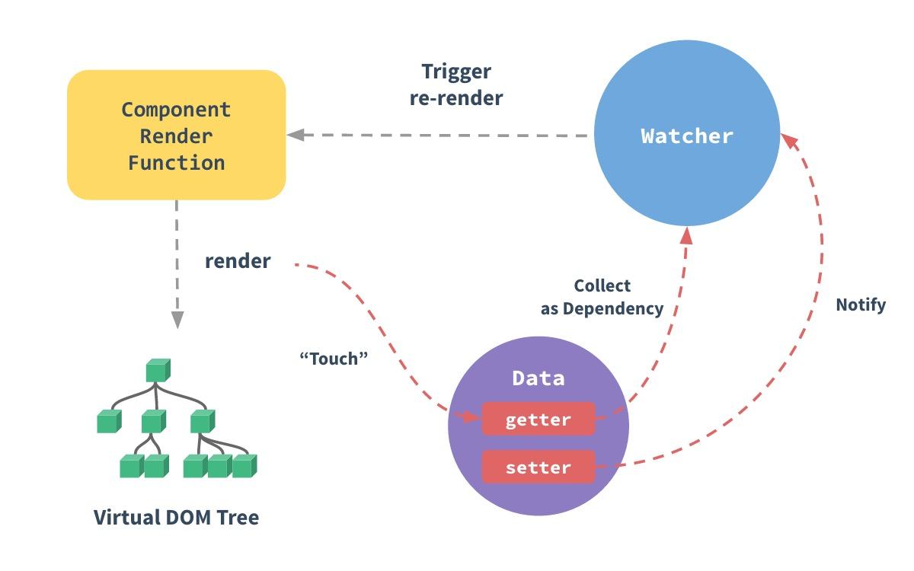

# 响应式原理

Vue 面试，抓两个大头—— 响应式原理、 nextTick

而响应式原理是 Vue 最核心的考点。

### 流程概述

来看 Vue 官方提供的原理图



图中有三个关键角色：**Watcher**、**Data**、和 **Render**

首先，Vue 会对 data 做处理：为每一个属性添加 getter 和 setter。此过程用到了 Object.defineProperty 方法。

同时，每个 Vue 组件实例，都会对应一个 watcher 实例。watcher 会一直跟踪 data 的变化。

那么 watcher 如何跟踪呢？分两种情况：

#### getter

render 函数执行时读取 data，会触发对应属性的 **getter** 方法。getter 触发后会通知 watcher，watcher 再取到 getter 对应的属性作为依赖，这就是 “依赖收集” 的过程。

#### setter

data 被修改，会立即触发对应属性的 **setter** 方法。setter 触发后也会通知 watcher，watcher 再告诉 render 去更新对应属性的组件，这就触发了一个 re-render 的过程。

### 响应式源码分析

上面说了 Vue 响应式原理。除了原理，更要知道如何实现的。

#### Object.defineProperty

这个方法用于在一个对象上定义新的属性或修改现有属性, 并返回该对象.

```js
Object.defineProperty(obj, prop, descriptor)
```

参数一是操作对象，参数二是属性名称，参数三是描述符。

Vue 用到的“描述符”，就是 getter/setter 方法。

看一个例子：

```js
const obj = {
  name: 'ruims',
  career: 'programer'
}
Object.defineProperty(obj, 'career', {
  // getter 方法
  get() {
    console.log('尝试读取工作')
  },
  // setter 方法
  set(newCareer) {
    console.log(`工作换成了${newCareer}`)
  },
});
```

这就是 Vue 为 date 属性添加 getter 和 setter 的实现方法。


### Observer、Dep 和 Watcher 的关系

在源码层次，大家需要把握好这三个角色：

* Observer：为 data 安装 getter/setter；
* Dep：在getter/setter 中收集依赖，通知 Watcher；
* Watcher：通知 render、触发重渲染了；

#### Observer

遍历所有的属性，给它们安装上 getter/setter 方法：

```js
class Observer {
    constructor() {
      // 具体逻辑在 observe 函数里
        observe(this.data);
    }
}

function observe (data) {
    // 取出所有的 key
    const keys = Object.keys(data);
    // 遍历所有属性
    for (let i = 0; i < keys.length; i++) {
       // 绑定 getter/setter 方法
       defineReactive(obj, keys[i]);
    }
}
```

在 defineReactive 里做绑定，就是设置描述符。

```js
function defineReactive (obj, key, val) {
    // 定义一个 Dep 对象，它的作用正如我们上文所说
    const dep = new Dep();
  
    Object.defineProperty(obj, key, {
        enumerable: true,
        configurable: true,
        get() {
            // 收集依赖、关联到 watcher
            dep.depend();
            return val;         
        },
        set(newVal) {
            if (newVal === val) return;
            // 感知更新、通知 watcher
            dep.notify();
        }
    });
}
```

#### Dep

它是 Watcher 和 Observer 之间的纽带，是“通信兵“。

```js
class Dep {
    constructor () {
      // 存储 Watcher 实例的数组
      this.subs = [] 
    }
  
    // 将 watcher 实例添加到 subs 中（这个方法在 Watcher 类的实现里会用到）
    addSub (sub: Watcher) {
        this.subs.push(sub)
    }
  
    // 收集依赖
    depend() {
        // Dep.target 实际上就是当前 Dep 对应的 watcher，我们下文会提及
        if (Dep.target) {
          // 把当前的 dep 实例关联到组件对应的 watcher 上去
          Dep.target.addDep(this)
        }
    }

    // 通知 watcher 对象发生更新
    notify () {
      const subs = this.subs.slice()
      // 这里 subs 的元素是 watcher 实例，逐个调用 watcher 实例的 update 方法
      for (let i = 0, l = subs.length; i < l; i++) {
        subs[i].update()
      }
    }
}
```

#### Watcher

watcher 实例对应当前组件，一开始就创建了。

```js
class Watcher {

    constructor() {
      ...
      // Dep 的 target 属性是有赋值过程的^_^，它是组件对应的 watcher 对象
      Dep.target = this                     
        ...
    }

    addDep (dep: Dep) {
      ...
      // 把当前的 watcher 推入 dep 实例的 watcher 队列（subs）里去
      dep.addSub(this)
      ...
    }
    
    update() {
      // 更新视图
    }
}
```

dep 和 watcher 之间互相关联，watcher 就是监听 Dep 的依赖属性队列，发生变化时render dom。
