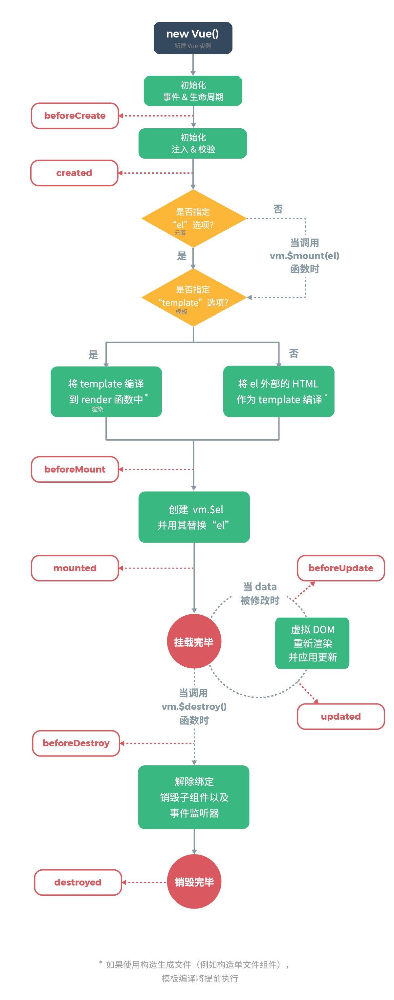
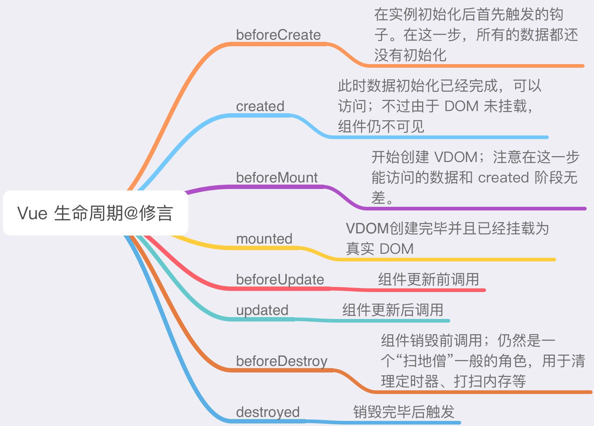
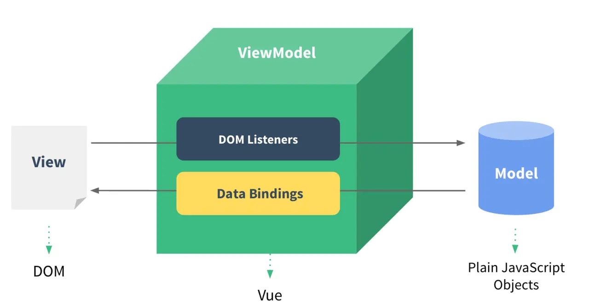

# Vue 零散知识

Vue 知识零散，这里只说 “频率高”、“区分度高” 的几块。
### 生命周期

先附上官方图：

再附修言大神总结图：

其中常用的就是：created 中请求数据，mounted 中挂载数据。

### keep-alive 与生命周期

keep-alive 是一个内置组件，当它包裹在组件外时，会将组件缓存到内存中，防止组件重复渲染。

阻止了重新渲染，那么生命周期必然有变化：

* 多出 **deactivated、actived** 两个生命周期
* beforeDestroy 和 destroyed 不会被触发

当组件跳转时，触发 deactivated；当组件被切回来时，触发 actived。

### 路由模式

路由使用 vue-router 实现，有三种模式：hash、history 和 abstract：

* hash：使用 URL hash 值来作路由。支持所有浏览器；
* history：需要 HTML5 History API 和服务器配置结合。对浏览器版本有要求，不支持低版本浏览器；
* abstract：支持所有 JavaScript 运行环境。如果当前环境没有浏览器 API，路由会自动进入这个模式.

这几种模式不是 Vue 专属，而是前端路由的通用解决方案。

想了解更多，请看 [前端路由](../../points/前端路由.md)

### 说说你对 MVVM 的理解

MVVM 是一种架构模式。如图是 Vue 的架构：

这三个角色大家要认清楚：

* View 层：视图层，对应到 `<template>` 标签的内容。
* VM 层：View-Model，对应到 Vue 实例。数据与视图双向绑定。
* Model 层：模型层，其实就是数据层。data 数据或 Vuex 数据

注意：**React 不是 MVVM 架构**，React 是一个单向数据流的库，状态驱动视图。

MVVM 区别于传统的 MVC。

区别的关键，就是 C（controller）和 VM（ViewModel）的区别。

1. **VM：** 模型视图。一是通过数据绑定，将模型数据映射到视图上；二是通过自定义事件，在视图操作中修改模型数据。核心是双向绑定。
2. **C：** 控制器。主要处理业务逻辑。负责从视图读取数据，控制用户输入，并向模型发送数据

MVVM 模型的关键，在于View的变化会直接映射在 ViewModel 中（反之亦然），这个映射的过程不需要你手动实现，而是 MVVM 框架来帮你做掉。