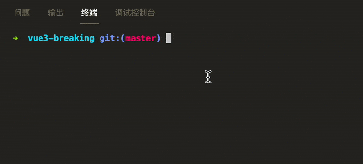

# Vue3 尝鲜

学习一个新框架的方向是什么？我觉得是先把环境装好，Demo 跑起来，然后在这个可运行的工程上面，根据文档的基础知识讲解，在项目代码上尝试修改运行，才能理解的更快。

所以 Vue3 尝鲜的第一步，先是用脚手架工具，然后将 demo 跑起来。

Vue3 有两大特色，一是更好的 `TypeScript` 支持，二是超快的构建工具 `vite`

既然尝鲜，特色菜必点。我们首先基于 `vite` 生成一个包含 ts 的项目骨架。

在终端执行命令：

```shell
$ npm init vite@latest
# 以下为 yarn 装法，后面不赘述
$ yarn create vite
```

根据提示，分别输入项目名称，模版（模版选 vue，默认初始化 vue3），再选 vue-ts，一个项目骨架就成型了。

进入项目，安装依赖，然后运行：



啥感觉？一个字就是**快**！默认项目，竟然不到 1s 就启动了，看来比 webpack 快几十倍不是吹出来的。
