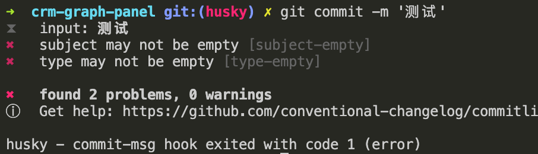

# husky

husky 是创建 git 客户端 hooks 的神器。

目前最新版本是 `7.*`，文档在[这里](https://typicode.github.io/husky/#/)

初始化 husky 只需要三步。首先要安装：

```sh
$ sudo yarn add husky -D
```

然后初始化 prepare 脚本。prepare 脚本在 `npm install` 之后自动执行。

```json
{
  "scripts": {
    "prepare": "husky install"
  }
}
```

最后运行脚本，会初始化一个 `.husky` 目录：

```sh
$ npm run prepare
# 或者运行
$ npx husky install
```

初始化后，就可以添加 hook 了。

添加一个 `commit-msg` 钩子，并指定一个默认 shell：

```sh
$ npx husky add .husky/commit-msg 'npx --no-install commitlint --edit "$1"'
```

现在在执行 `git commit` 之前，就会执行上面指定的 shell。

### commitlint

上面的 shell 里有一个 `commitlint` 命令，其实它是另一个工具，用来校验 commit 提交信息，这是 `husky + commitlint` 这对黄金搭档的主要功能。

commitlint 的文档在[这里](https://github.com/conventional-changelog/commitlint/#what-is-commitlint)

为了直观的看出 commit 的更新内容，开发者社区诞生了一种规范，将 commit 按照功能划分，加一些固定前缀，比如 `fix:`，`feat:`，用来标记这个 commit 主要做了什么事情。

`commitlint` 命令就是校验 commit 信息是否符合上述规范，不符合，则会配合 husky 阻止提交。

首先安装 commitlint：

```sh
$ yarn add -D @commitlint/{config-conventional,cli}
```

然后创建配置文件：

```sh
echo "module.exports = {extends: ['@commitlint/config-conventional']}" > commitlint.config.js
```

这样就好了，然后我们随便改一处代码，试试效果：

```sh
$ git add .
$ git commit -m '测试'
```

因为 “测试” 不符合 commit 规范，所以被阻止了，执行结果如下：



我们再试一下符合规范的提交格式：

```sh
$ git commit -m 'fix: 修复**功能'
```

这样就可以通过了！

规范化 git 提交是团队开发标准化最重要的一步，一定要推下去。
