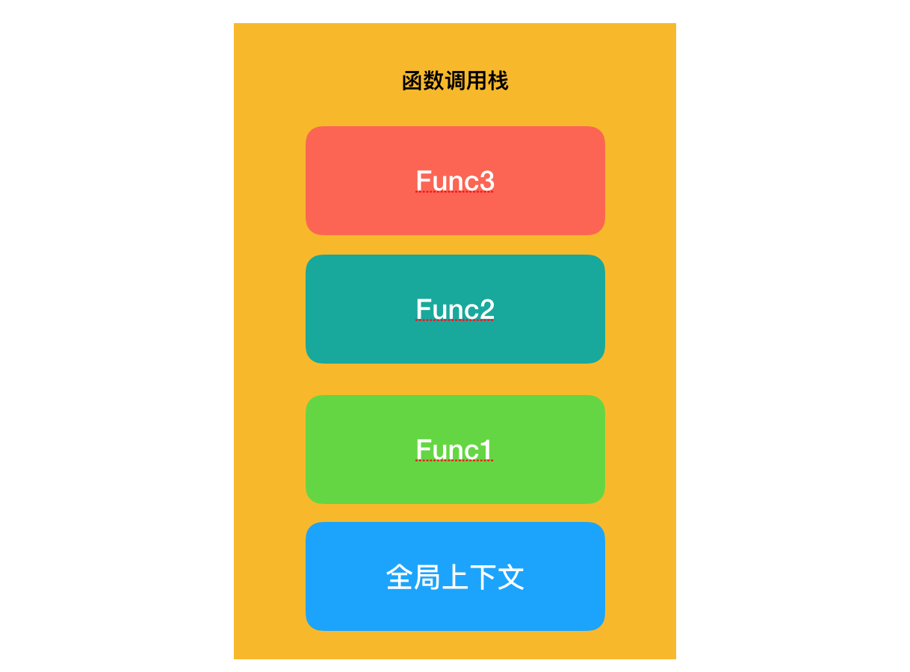
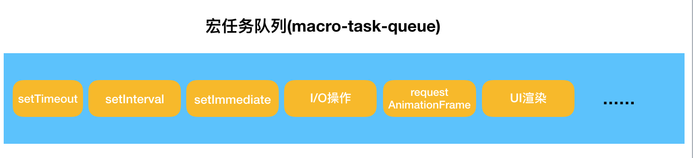
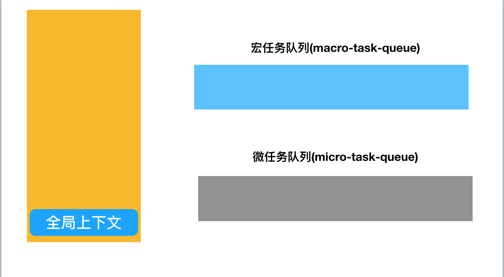
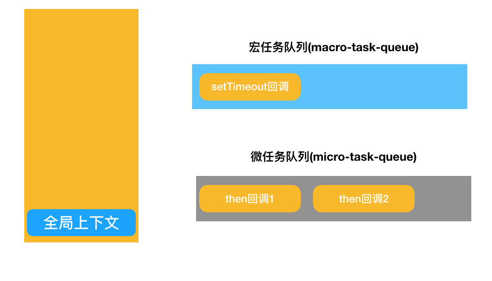

# 05 事件循环

事件循环，也就是 Event-Loop，它是 js 实现异步的关键，在整个基础知识体系中都非常重要。

从一道面试题说起：

```js
console.log(1)

setTimeout(function() {
  console.log(2)
})

new Promise(function (resolve) {
  console.log(3)
  resolve()
 }).then(function () {
  console.log(4)
}).then(function() {
  console.log(5)
})

console.log(6)
```

答案是：1、3、6、4、5、2

为什么是这个顺序？接下来剖析一下

### 关键角色剖析

首先要认清楚 3 个角色：

* 函数调用栈
* 宏任务（macro-task）队列
* 微任务（micro-task）队列

函数调用栈学过了：当引擎第一次遇到 JS 代码时，会产生一个全局执行上下文并压入调用栈。后面每遇到一个函数调用，就会往栈中压入一个新的函数上下文。JS引擎会执行栈顶的函数，执行完毕后，弹出对应的上下文



一句话：如果你有要执行的逻辑，它首先需要被推入函数调用栈，后续才能被执

宏任务队列、微任务队列是啥？

像 setTimeout 里的逻辑和 promise.then 中的逻辑，这些逻辑是异步的，**并不具备立刻进入调用栈的“资格”**

不具备怎么办？排队等呗！

于是这些待执行的任务，按照一定的规则排起长队，等待着被推入调用栈。这个队列，就叫做“任务队列”。

所谓“宏任务”与“微任务”，是对任务的进一步细分。




注意：script（整体代码）它也是一个宏任务；此外，宏任务中的 setImmediate、微任务中的 process.nextTick 这些都是 Node 独有的。

### 循环过程解读

一个完整的 Event Loop 过程，可以概括为以下阶段：

1. 执行并出队一个 macro-task。第一个 macro-task 就是 script 脚本
2. 全局上下文（script 标签）被推入调用栈，同步代码执行(包括函数)。这一步可能会产生新的 macro-task 与 micro-task。
3. 依次执行完并清空上一步产生 micro-task 队列
4. 执行渲染操作，更新界面
5. 检查是否存在 Web worker 任务，如果有，则对其进行处理

如果走完这5个步骤的过程中产生了新的宏任务，那么宏任务队列的每个任务按照顺序继续走这5个步骤，从而形成了事件循环，直到宏任务队列清空

默认情况下，即初始状态时，调用栈为空，micro 队列空，macro 队列里有且只有一个 script 脚本（整体代码）

> 注意：一个宏任务出队执行时，在第 3 步，不管微任务队列中有多少个任务，都要依次执行直到队列被清空


### 真题重做，逐行分析

还是文章开头的拿到面试题，用事件循环的角度重新解析一下

首先， script 脚本作为第一个宏任务进入调用栈，并创建了全局上下文。与此同时，宏任务队列被清空。



全局代码开始执行，首先先打印出 **1** 。

接下来，执行到 setTimeout 这句，一个宏任务被派发

再往下走，遇到了一个 Promise，这个 Promise 有两个 then 方法，两个微任务依次被派发

> 注意：Promise 函数体中的代码是同步代码立即执行，只有then和catch中的代码是异步的，需要放到微任务队列

此时，任务队列是这样的：



接下来走到最后，打印出 **6**，同步任务执行完毕。

不过要注意，**全局上下文** 并不会因此消失 —— 它与页面本身共存亡。

接下来正式执行异步任务。

#### 处理异步任务

首先，微任务队列遵循**先进先出**的原则，依次将任务推入调用栈执行。

微任务队列所有任务执行完毕，才去执行宏任务队列。


接下来，执行一个宏任务。此时两个任务队列被清空。

关闭浏览器标签，全局上下文销毁，事件循环结束。

注意事件循环的原则：**一个宏任务，一队微任务**，直到队列清空。
