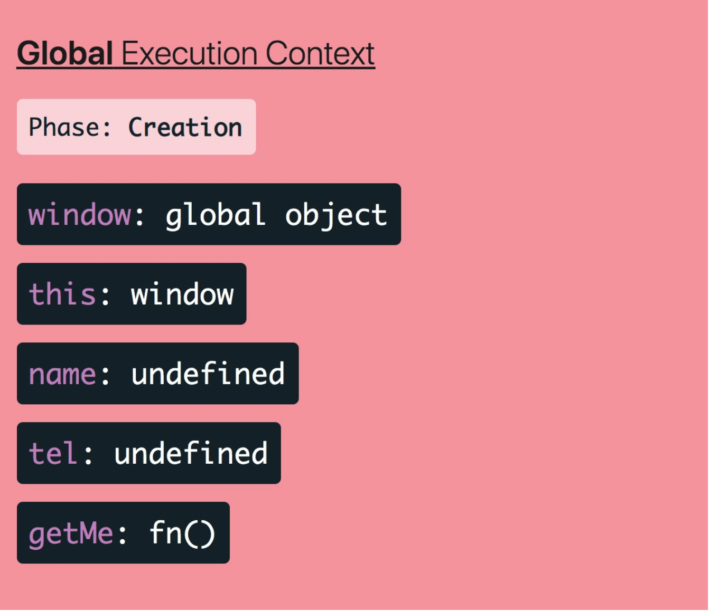
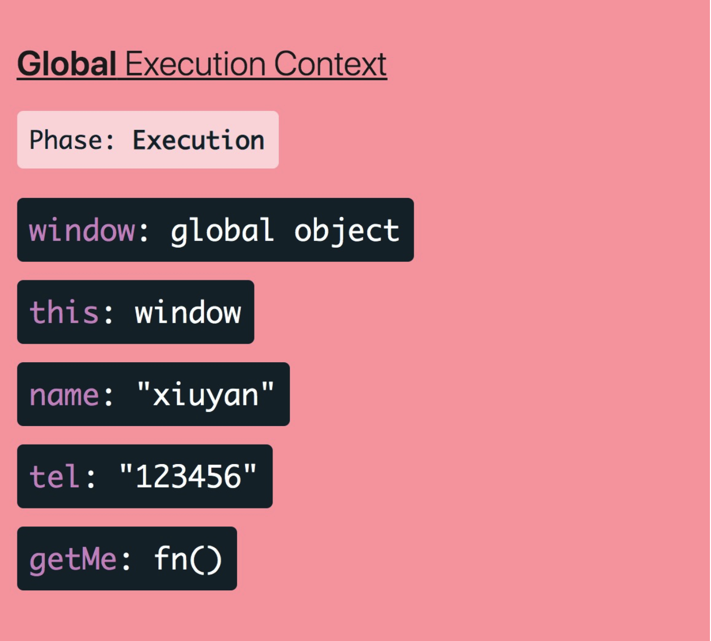
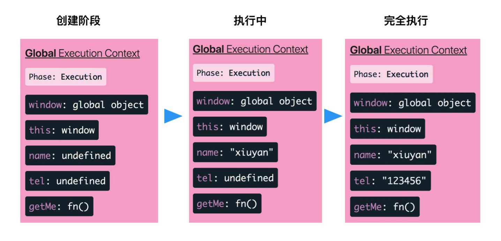
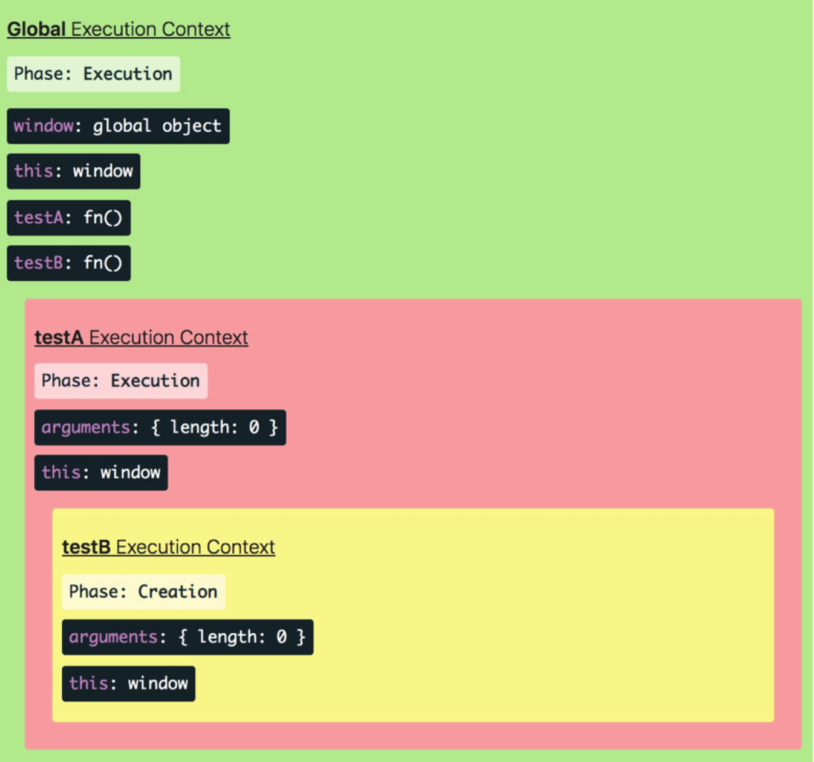

# 08 执行上下文

在 js 核心知识体系中，闭包，作用域，变量，this 等等，都是单个知识点。这章用一个完整的知识链路把他们串起来理解。

这个知识链路就是 `js的执行上下文`

### 为什么要有执行上下文

我们在写一个大型项目时，不可能把成千上万行代码堆到一起，必然要分文件，分模块，分方法的写。

同理，JS 引擎执行任务时，也不能把所有的执行任务一次执行，必然要划分出不同的执行上下文，“分块”执行。

**执行上下文理解为对任务的 “分块” 执行**

### 执行上下文是什么

定义：执行代码的环境 —— 任何代码都在执行上下文中运行

如何理解？从分类、组成和生命周期等方面理解

#### 执行上下文的分类

* 全局上下文 —— 全局代码所处的环境
* 函数上下文 —— 函数调用时创建的上下文
* Eval 执行上下文（跳过）

## 全局上下文

JS 脚本运行起来后，全局上下文首先被创建。

如果脚本里没代码，那么全局上下文里只有两个东西：

* 全局对象（Window 或 Global）
* this，指向全局变量

现在加几行代码：

```javascript
var name = 'xiuyan'
var tel = '123456'

function getMe() {
    return {
        name: name,
        tel: tel
    }
}
```

全局上下文会变成这样：



这里有个疑问，name 和 tel 都赋值了，为啥还是 undefined 呢？

这里涉及到了上下文的生命周期。

### 生命周期

执行上下文的生命周期有两个阶段：

* 创建阶段 —— 初始化状态，此时代码未执行
* 执行阶段 —— 逐行执行脚本里的代码

#### 创建阶段

创建阶段做了以下几件事：

* 创建全局对象（Window 或 Global）
* 创建 this ，并让它指向全局对象
* 给变量和函数分配内存空间
* 默认给变量赋值为 undefined；将函数声明放入内存
* 创建作用域链

上一张图片就是创建阶段执行上下文的样子

#### 执行阶段

到这里，真正的赋值动作才开始执行

代码一行一行的执行完后，上下文是这样：



注意：**执行上下文在执行阶段是动态的**



### 变量提升

```javascript
// 没有报错，而是输出 undefined
console.log(name)

var name = 'xiuyan'
```

这个现象，我们之前叫 “变量提升”。

现在理解了上下文后，其实不存在所谓的 “变量提升”，只是执行上下文在创建阶段创建了变量，执行阶段赋值了而已，这才是 “变量提升” 的本质

## 函数上下文

与全局上下文基本一致，我们关注一下区别：

* 创建时机 —— 全局上下文在`运行脚本`时被创建，函数上下文在`函数调用`时被创建
* 创建频率 —— 全局上下文仅在运行初始创建一次；函数上下文调用一次创建一次
* 创建阶段 —— 全局上下文创建全局对象（Window），函数上下文创建参数对象（arguments），this的指向取决于函数如何被调用（可能是引用对象，全局对象或undefined）

函数上下文创建阶段如下：


## 调用栈

因为函数上下文有多个，不可能保存所有的上下文。所以这里需要一个”栈“来只保存当前上下文，这个栈叫做执行上下文栈，也叫 ”调用栈“

函数开始执行，执行上下文创建，这个过程叫 ”入栈“ 
函数执行完毕，执行上下文随之消失，这个过程叫 ”出栈“  

>调用栈中会有一个全局上下文和多个函数上下文

我们来看代码解析调用栈：

```javascript
function testA() {
  console.log('执行第一个测试函数的逻辑');
  testB();
  console.log('再次执行第一个测试函数的逻辑');
}

function testB() {
  console.log('执行第二个测试函数的逻辑');
}

testA();
```

1. 执行之初，全局上下文创建：


1. 执行到 testA 调用处，testA 对应的函数上下文创建：


1. 执行到 testB 处，testB 对应的函数上下文创建：



1. testB 执行完毕，对应上下文出栈，剩下 testA 和 全局上下文

2. testA 执行完毕，对应执行上下文出栈，剩下全局上下文

### 站在调用栈的角度，理解作用域的本质

之前，我们认为作用域是” 访问变量的一套规则 “。

学完这章，作用域其实就是 **当前所处的执行上下文**

#### 作用域隔离

上面的示例代码中，因为 testB 函数最后被推入调用栈，且在它执行完后立即出栈。所以当切换到 testA 的执行上下文时，testB 的执行上下文压根不存在于调用栈内 

所以，既然不存在，当然找不到它内部的变量，这就是”隔离“

#### 再谈闭包

一般来说，函数出栈后，就无法再访问到函数内部的变量了

然而，闭包例外：

```javascript
function outer(a) {
  return function inner (b) {
    return a + b;
  };
}

var addA = outer(10);

addA(20)
```

这个例子中，outer 函数在执行完毕出栈后，a 变量应该不存在了，事实上 inner 函数还能访问到 a 变量，这是为什么呢？

根源在于：执行上下文的创建阶段，跟着被创建的还有**作用域链**！

作用域链会被存储到函数的内部属性，父变量对象就在这个内部属性中。因此闭包正式通过这一层的关系，实现了对父作用域执行上下文信息的保留。

#### 自由变量的查找

自由变量的查找，是作用域链与上下文变量的结合

仍然说回 testB，当代码执行到 testB 时，它处在栈顶，testA 和全局上下文在栈底，为查找变量提供了条件

查找变量时，如果在 testB 中未找到，会沿着**作用域链**向上查找，注意是作用域链而不是调用栈！！