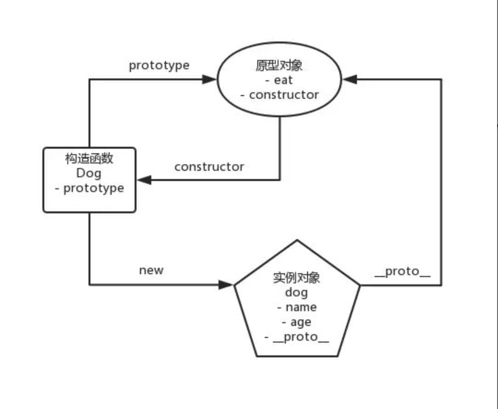
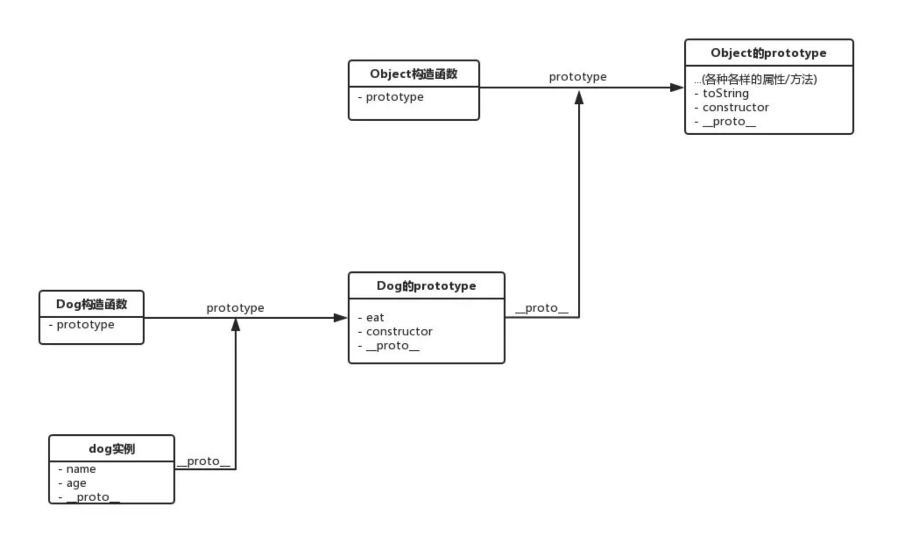

# 06 面向对象

JS 中的面向对象，围绕原型和原型链知识展开。

原型（Prototype）模式其实还是一种设计模式，同时更是一种是一种编程范式（programming paradigm）。

### 理解原型编程范式

原型是 JavaScript 面向对象的根本。但在其它语言，比如 JAVA 中，类才是面向对象的根本

**那么原型和类有什么区别呢？**

类是对一类实体的结构、行为的抽象，它关注**抽象**！

而在 JS 这样的原型语言中，我们首先需要关注的就是**具体******

js面向对象的根本是，通过对原型对象的引用来做到了能力 “复制”。

### ES6类语法解析

```JavaScript
class Dog {
  constructor(name ,age) {
   this.name = name
   this.age = age
  }
  
  eat() {
    console.log('肉骨头真好吃')
  }
}
```
这是下面函数的语法糖:

```javascript
function Dog(name, age) {
  this.name = name
  this.age = age
}
Dog.prototype.eat = function() {
  console.log('肉骨头真好吃')
}
```

js面向对象永远是基于原型的！

## 理解原型与原型链

### 原型

原型一般指的就是原型对象。

> 原型对象就是一个有 construtor 属性的对象，没什么神奇的。

* 构造函数有 prototype 属性，指向它的原型对象
* 原型对象中有 construtor 属性，指回构造函数；
* 实例有__proto__属性，指向构造函数的原型对象
* 原型对象也有__proto__属性，指向上上层原型对象，直到原型对象为 null。

> null 没有原型，是原型链中的最后一个环节。

> 因此，构造函数.`prototype` == 实例.`__proto__`

来看例子：

```javascript
// 创建一个Dog构造函数
function Dog(name, age) {
  this.name = name
  this.age = age
}
Dog.prototype.eat = function() {
  console.log('肉骨头真好吃')
}
// 使用Dog构造函数创建dog实例
const dog = new Dog('旺财', 3)
```

关系图如下：



模拟一个 new 的实现：

```js
function imitateNew(fun) {
  // fun是构造函数
  if (typeof fun != 'function') {
    throw new Error('type error')
  }
  let args = [].slice.call(arguments, 1)
  // 创建新对象并设置原型继承
  let obj = {}
  obj.__proto__ = fun.prototype
  // 上面两行等于这个：
  // let obj = Object.create(fun.prototype)
  let result = fun.apply(obj, args)
  return result ? result : obj
}

// 使用
const dog = imitateNew(Dog, '旺财', 3)
```
### 原型链

还是上面的代码，我们调用一下：

```javascript
dog.eat()
// 输出"肉骨头真好吃"
dog.toString()
// 输出"[object Object]"
```

 eat 和 toString 方法，并没有手动定义，但它们还是被成功地调用了.
 
当访问一个 Js 实例的属性/方法时，它首先搜索这个实例本身；如果找不到，它会转而搜索实例的原型对象；如果还找不到，它就去搜索原型对象的原型对象，一直往上找，这个搜索的轨迹，就叫做原型链。



图中彼此相连的 prototype，就构成了所谓的 “原型链”

### 注意

几乎所有 JavaScript 中的对象都是位于原型链顶端的 Object 的实例，除了 Object.prototype

因为 Object.prototype.\__proto\__ = null

如果我们手动用 Object.create(null) 创建一个没有任何原型的对象，那它也不是 Object 的实例。
