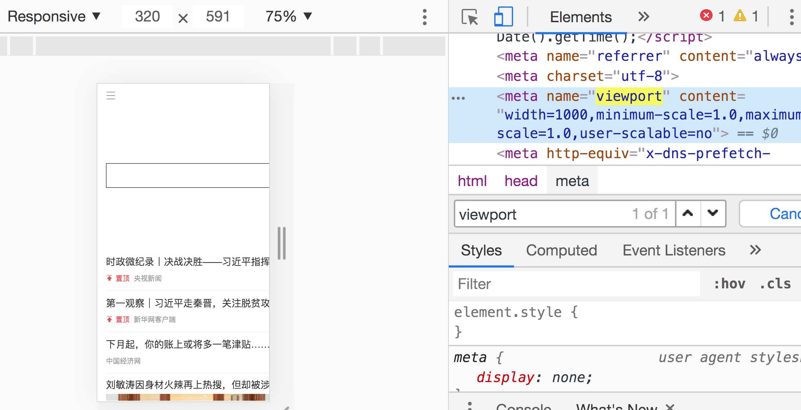
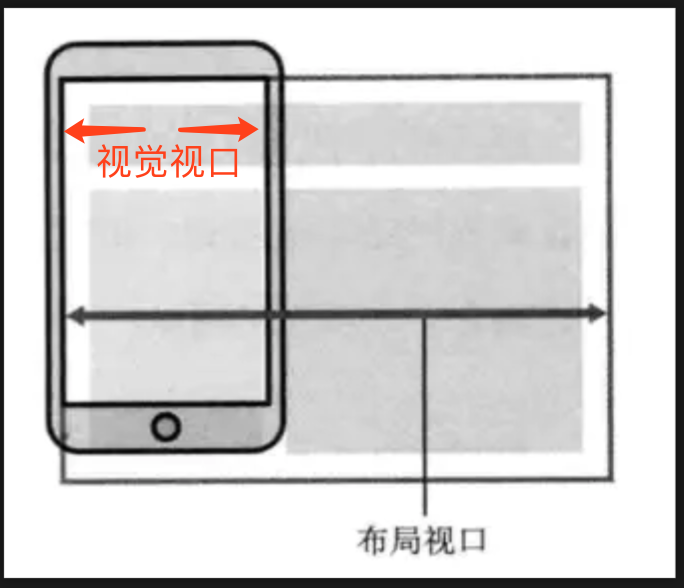

# 响应式布局

响应式布局，可以衍生出一个非常完整的移动端适配的知识链路。

两个重点概念：viewport 和 rem、em。

### 1. 理解 viewport

viewport 也叫“视口”，通过 meta 标签来控制。

其实视口有3种，我们来介绍：

#### 布局视口（layout viewport）与视觉视口（visual viewport）

在移动端开发中，常见到这种 meta 标签写法。

```html
<meta name="viewport" content="width=device-width">
```

为什么一定要设置 width=device-width？

假设把 width 改为 1000：



就会出现这种情况：屏幕不能完全显示网页内容，会被截掉一部分。

**这是由于视觉视口和布局视口不相等导致的**。

视觉视口，也就是可见的屏幕宽度，移动端是 320；而我们改的 1000，则是浏览器的布局视口。因为布局视口大于视觉视口，所以只能看到一部分。



视觉视口获取方法：

**window.innerWidth** 和 **window.innerHeight**

布局视口宽度获取方法：

**document.documentElement.clientWidth**

#### 理想视口（ideal viewport）

实际上，我们在做网页布局的时候，不能设置一个固定的宽度，来匹配所有的视觉视口。

这时候人们提出了“理想视口”，即理想情况下让布局视口自动的等于屏幕宽度。

怎么办？就是我们开始的那行代码：

```html
<meta name="viewport" content="width=device-width">
```

这这是理想视口的设置方法。

### 2. 理解 rem 和 em

rem 和 em 都是动态计算的尺寸。

#### 什么是 rem

rem 指的是相对于HTML根元素的字体大小（font-size）来计算的值。

比如：

```css
html { 
  font-size: 100px; 
}
```

那么 **1rem = 100px**；

此时假如我们给一个 div 设置这样的样式:

```css
div { 
  width: 1rem; 
  height: 2rem; 
}
```

那么这个 div 的宽就是 100px，高就是 200px。

#### 什么是 em

和 rem 一样的计算值。区别是 rem 是 html 的字体大小，em 是元素本身的字体大小。

```css
div {
   font-size: 20px;
   padding: 10em;
   width: 20em;
}
```

这个 div 的 padding 值为 200px，width 值为 400px。

##### em 与继承相结合

有些情况下，em 好像取的是父元素的字体大小。其实这是一个误区。

根本原因，是因为元素本身未设置字体大小，而继承了父元素的设置，所以看起来好像是 em 取了父元素的设置。

实际上，不管元素本身有没有显式地设置 font-size，**em 取的都是当前元素的 font-size**。

### 3. 响应式布局

响应式布局的目的是为了让我们的页面能够在不同大小的设备屏幕上正常展示。

即不同宽度的屏幕可以展示出不同的内容。

三种常用方案：

* 媒体查询
* rem
* vw/vh

#### 媒体查询

既然要在不同宽度屏幕上展示不同内容，最直观的方法就是感知屏幕变化。媒体查询就是做这个的。

用法很简单，也很直观：

```css
@media screen and (max-width: 320px) {
    div {
     width: 160px;
    }
}

@media screen and (min-width: 768px) {
    div {
     width: 300px;
    }
}
```

@media 是媒体查询属性的标识，“screen”指的是媒体类型。

括号里的宽度判断是重点：

* max-width：实际宽度不大于此，应用该样式；
* min-width：实际宽度不小于此，应用该样式；

#### rem

上一节我们已经知道，rem 是一个以根元素 font-size 大小为基准的相对单位。

那么如果页面中都使用了 rem，只要动态修改根元素的 font-size，就可以实现响应式布局。

```js
function refreshRem() {
    // 获取文档对象(根元素）
    const docEl = doc.documentElement;
    // 获取视图容器宽度
    const docWidth = docEl.getBoundingClientRect().width;
    // rem 取值为视图容器宽度的十分之一大小
    const rem = width / 10;
    // 设置 rem 大小
    docEl.style.fontSize = rem + 'px';
}
// 监听浏览器窗口大小的变化
window.addEventListener('resize', refreshRem);
```

这段代码节选自一个非常经典的轮子 —— flexible.js，就是基于 rem 实现响应式布局。

#### vw/vh

vw 和 vh 是一个动态尺寸单位。

* vw：1vw = 视觉视口宽度 / 100；
* vh：1vh = 视觉视口高度 / 100

所以，**1vw 是屏幕宽度的 1%；1vh 则是屏幕高度的 1%**；

vw/vh 一般用来给 div 设置宽高。

### 高清方案

在移动端开发中，前端在接过设计稿实现页面的时候，会遇到这种情况：

设计稿的宽度是固定的 **750px**，而我们手机屏幕宽度是不一样的，怎么适配呢？

这里有计算公式：

**viewport-width = screen.width * dpr**

> dpr：设备像素比。dpr = 物理像素 / css 像素