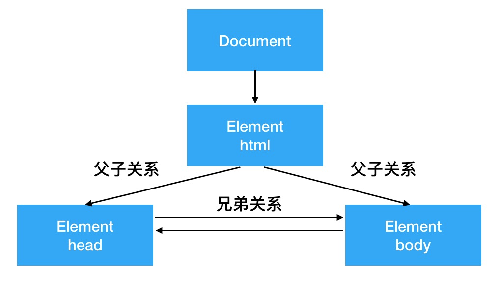

# 基础知识

文档对象模型 (DOM) 是 HTML 和 XML 文档的编程接口

DOM 的根本原理，是把 HTML 中标签定义出的元素以对象的形式包装起来

**DOM 不仅是一套接口，更是一套规范**

DOM 作为 W3C 规范的一部分，约束了浏览器中 JS 与 HTML 间交互的方式，因此程序员才有机会用同一套 API 去操作 HTML，不必关心浏览器底层差异

### DOM 树的解析

DOM 结构以树的形态存在，树中的最小单位是节点

**DOM 中一切都是节点**

这里有 4 种节点类型

#### 1. Document

包含整个 DOM 树，即整个 HTML 文档。当浏览器载入 HTML 文档, 它就会成为 Document 对象

#### 2. Element

指 HTML 文件内的各个标签，比如`<div>、<span>`

#### 3. Text

指被各个标签包起来的文字，比如：

```jsx
<span>哈哈哈</span>
```

”哈哈哈“就是 Text 节点

#### 4. Attribute

指各个标签里的属性

### 一颗 DOM 树

来一个基本栗子:

```html
<html>
  <head>
    <title>DEMO</title>
  </head>
  <body>
    <h1 class="title">我是标题</h1>
  </body>
</html>
```

在这个基础 DEMO 里，整个 HTML 文件可以被看做是一个 Document，根节点就是 html。

我们用树状图表示一下：


### DOM 节点间关系

在树状结构的 DOM 里，节点间关系可以划分为以下两类：

- 父子节点：表示节点间的嵌套关系
- 兄弟节点：表示节点层级的平行关系



### 常考操作

**查：DOM 节点的获取**

```js
document.getElementById - // 按照 id 查询
document.getElementsByTagName - // 按照标签名查询
document.getElementsByClassName - // 按照类名查询
document.querySelectorAll; // 按照 css 选择器查询
```

一起来看看具体怎么用

```javascript
// 按照 id 查询
var imooc = document.getElementById("imooc"); // 查询到 id 为 imooc 的元素

// 按照标签名查询
var pList = document.getElementsByTagName("p"); // 查询到标签为 p 的集合
console.log(divList.length);
console.log(divList[0]);

// 按照类名查询
var moocList = document.getElementsByClassName("mooc"); // 查询到类名为 mooc 的集合

// 按照 css 选择器查询
var pList = document.querySelectorAll(".mooc"); // 查询到类名为 mooc 的集合
```

除了 `getElementById` 获取的是单个元素，其他的 API 获取的都是元素集合

**增：DOM 节点的创建**

```javascript
// 首先获取父节点
var container = document.getElementById("container");

// 创建新节点
var targetSpan = document.createElement("span");
// 设置 span 节点的内容
targetSpan.innerHTML = "hello world";

// 把新创建的元素塞进父节点里去
container.appendChild(targetSpan);
```

**删：DOM 节点的删除**

```javascript
// 获取目标元素的父元素
var container = document.getElementById("container");
// 获取目标元素
var targetNode = container.childNodes[1];
// 删除目标元素
container.removeChild(targetNode);
```

**改：修改 DOM 元素**

移动 DOM 元素的位置，修改 DOM 元素的属性等

真题：将指定的两个 DOM 元素交换位置_

```html
<html>
  <head>
    <title>DEMO</title>
  </head>
  <body>
    <div id="container">
      <h1 id="title">我是标题</h1>
      <p id="content">我是内容</p>
    </div>
  </body>
</html>
```

```javascript
// 获取父元素
var container = document.getElementById("container");

// 获取两个需要被交换的元素
var title = document.getElementById("title");
var content = document.getElementById("content");

// 交换两个元素，把 content 置于 title 前面
container.insertBefore(content, title);
```

_真题：DOM 元素属性的获取和修改_

```javascript
var title = document.getElementById("title");

// 获取 id 属性
var titleId = title.getAttribute("id");

// 修改 id 属性
title.setAttribute("id", "anothorTitle");
```
