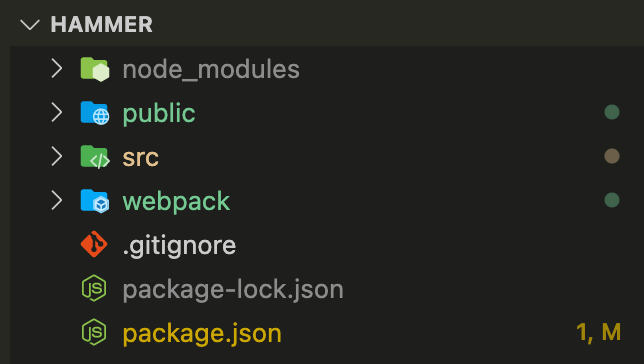

# 初始化项目

工程化的项目，首先安装好 nodejs 和 npm。我的版本是：

- node：v14.16.0
- npm：v6.14.11

创建项目文件夹，使用 npm 初始化项目：

```sh
mkdir hammer
cd hammer
npm init -y
```

接下来安装 webpack 套件：

```sh
npm install 
    webpack 
    webpack-cli
    webpack-dev-server
    --save-dev
```

**webpack-cli** 提供 webpack 命令供终端使用。

**webpack-dev-server** 是提供了小型的 http 服务器，将编译好的文件放入内存，实现热更新。

项目中要生成 HTML 文件，所以再安装一个生成 html 的插件：

```js
npm install html-webpack-plugin --save-dev
```

安装完成后，创建文件夹：

- src：源文件目录
- webpack：配置目录
- public：存放 html 文件

项目结构如下：



**.gitignore**

```text
node_modules
dist
package-lock.json
```

**public/index.html**

```html
<!DOCTYPE html>
<html lang="en">
<head>
    <meta charset="UTF-8">
    <meta http-equiv="X-UA-Compatible" content="IE=edge">
    <meta name="viewport" content="width=device-width, initial-scale=1.0">
    <title>hammer</title>
</head>
<body></body>
</html>
```

**src/index.js**

```js
var app = document.createElement('div')
app.id = 'app'
app.setAttribute('style', 'width:200px;height:100px;background:green')

document.body.appendChild(app)
```

**webpack/dev.config.js**

```js
const path = require('path');
const HtmlWebpackPlugin = require('html-webpack-plugin');

module.exports = {
    mode: 'development',
    entry: './src/index.js',
    plugins: [
        new HtmlWebpackPlugin({
            title: 'Development',
            inject: 'body',
        })
    ],
    devServer: {
        contentBase: './dist',
    },
    output: {
        filename: '[name].bundle.js',
        path: path.resolve(__dirname, '../', 'dist'),
    }
}
```

**package.json**

```json
{
  "name": "hammer",
  "version": "1.0.0",
  "description": "webpack function",
  "scripts": {
    "dev": "webpack -c webpack/dev.config.js --watch",
  },
  "author": "",
  "license": "ISC",
  "dependencies": {},
  "devDependencies": {
    "webpack": "^5.24.2",
    "webpack-cli": "^4.5.0",
    "webpack-dev-server": "^3.11.2",
    "html-webpack-plugin": "^5.2.0",
  }
}
```

这样，一个初步的 webpack 工程就搭建好了。

下一章，详细描述 webpack 配置项。
