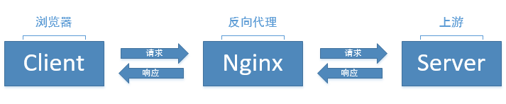

# header 请求头相关

nginx 配置中用于设置请求头的字段有两个，`add_header` 和 `proxy_set_header`，很多时候搞不清它们两有什么区别，这里记录一下。

对于前端来说，nginx 最大的最用就是做反向代理，请求流程如下：



### proxy_set_header

如上图，nginx 将请求转发给上游服务器，proxy_set_header 的作用就是为上游服务器设置请求头。

语法格式：

```bash
proxy_set_header [field] [value];
# value 的值可以是文本或变量，如：
proxy_set_header Host $proxy_host;
proxy_set_header version 1.0;
```

### add_header

add_header 的作用就是为下游浏览器设置请求头。

最常用的，就是设置跨域访问：

```bash
add_header 'Access-Control-Allow-Origin' '*';
add_header 'Access-Control-Allow-Headers' 'X-Requested-With';
add_header 'Access-Control-Allow-Methods' 'GET,POST,OPTIONS'
# 由于跨域请求，浏览器会先发送一个OPTIONS的预检请求，我们可以缓存第一次的预检请求的失效时间
if ($request_method = 'OPTIONS') {
	add_header 'Access-Control-Max-Age' 2592000;
	add_header 'Content-Type' 'text/plain; charset=utf-8';
	add_header 'Content-Length' 0;
	return 204;
}
```
