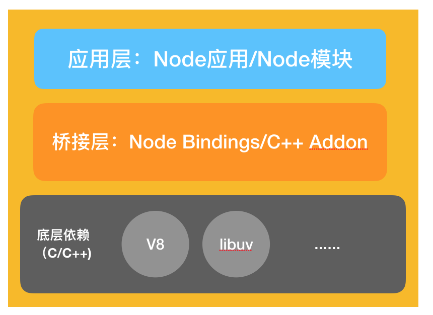
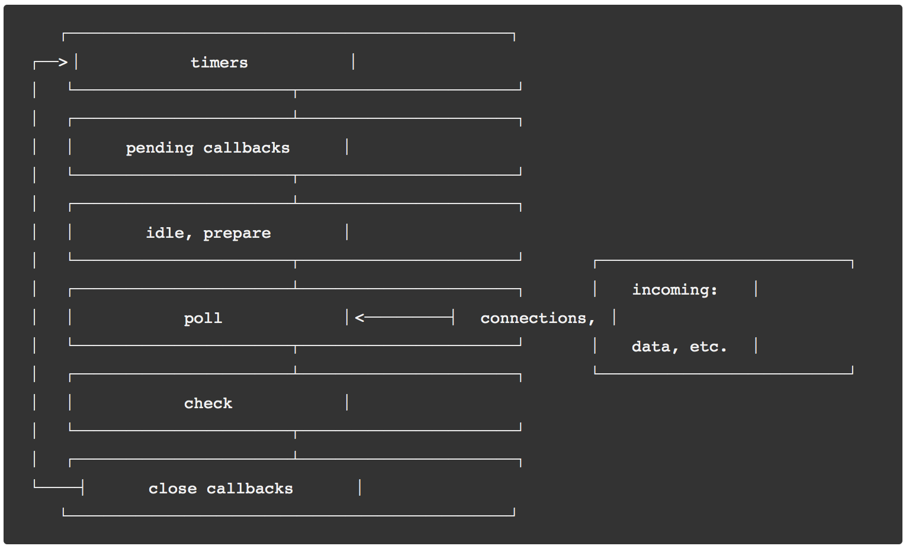

# 事件循环

我们知道，Node.js 的最大亮点，就是**单线程的异步非阻塞 I/O**。而实现这个机制的，就是事件循环。

在 js 核心部分，我记录过浏览器的事件循环，从[这里](../../core/事件循环.md)回顾。

Node.js 与浏览器的事件循环原理基本相似，但是运行机制不同。

### 认识 libuv

首先附上一张简化的 Node.js 架构图：



Node 整体上由这三部分组成：

1. 应用层：Node.js 代码
2. 桥接层：将底层 c++ 的能力封装为 API 向应用层开放
3. 底层依赖：C++ 库，最重要的就是 V8 和 libuv

**V8**：JS 的运行引擎，它负责把 JavaScript 代码转换成 C++

**libuv**：封装异步 I/O 能力，初始化事件循环

**浏览器的 Event-Loop 由各个浏览器自己实现；而 Node 的 Event-Loop 由 libuv 来实现**。

### libuv 中的 Event-Loop



共六个阶段，有不同的任务：

- **timers 阶段**：执行 setTimeout 和 setInterval 中定义的回调；
- **pending callbacks**：处理 IO 的错误的回调（比较少见，可以略过）；
- **idle, prepare**：仅系统内部使用（可以略过）；
- **poll （轮询阶段）**：重点阶段，会执行 I/O 回调，检查定时器是否到期；
- **check（检查阶段）**：处理 setImmediate 中定义的回调
- **close callbacks**：处理一些“关闭”的回调，如 socket.on('close', ...)

### 宏任务与微任务

上述的 6 个阶段中，需要重点关注的是 3 个阶段：

**timers**、**poll** 和 **check**

面试题一般出在这三个阶段。

事件循环流程如下：

1. 执行全局的 Script 代码（与浏览器无差）；
2. 执行并清空微任务队列（next-tick 队列和其它队列）
3. 执行并清空宏任务队列（区别于浏览器）
4. 从步骤 3 开始，会进入 3 -> 2 -> 3 -> 2…的循环

浏览器宏任务 “一个一个” 地执行，Node 浏览器 “一队一队” 地执行.

#### Node 独有

`setImmediate` 和 `process.nextTick` 这两个函数只在 Node 中有，浏览器是没有的。

process.nextTick 是将一个任务放到微任务队列：

```js
process.nextTick(() => {
  // ...我在微任务队列
});
```

setImmediate 是将一个任务放到宏任务队列：

```js
setImmediate(() => {
  // ...我在宏任务队列
});
```

延迟 0 毫秒的 setTimeout() 回调与 setImmediate() 非常相似，都在宏任务队列中，执行顺序取决于各种因素，不固定。
