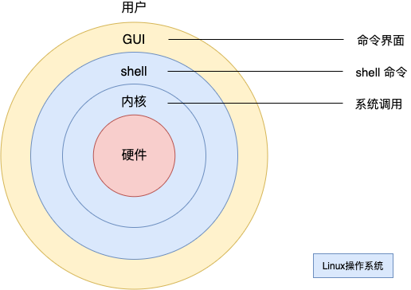

# shell 基础

Shell 是 linux 下的脚本解析器，英译为壳子，就是 Linux 内核外面包裹的一层外壳。Shell 提供了一系列 Shell 命令，用于用户与内核交互。

上一张操作系统结构图：



Shell 和内核组成了 Linux 操作系统，如图中的蓝色部分。用户在 GUI 层（终端或者应用程序界面）执行 Shell 命令，就能通过 Linux 操作硬件资源。

所以 Shell 是用户使用 Linux 的桥梁，也是调用硬件资源的桥梁。

### shell 分类

Shell 也是有分类的，必须了解的三种 Shell：

- **Sh**：Bourne Shell 的缩写。是所有 Shell 的祖先。
- **Bash**：Bourne Again Shell 的缩写。是 Sh 的进阶版本，是大多数 Linux 发行版和苹果的 macOS 操作系统的默认 Shell。
- **Zsh**：Z Shell 的缩写，比较新的一个 Shell，是各种 Shell 的集大成。现在最推荐使用的 Shell。

> 推荐一个 Zsh 的炫酷配置 [oh-my-zsh](https://github.com/ohmyzsh/ohmyzsh) ，相信你会爱上它。

每种 shell 都有自己的配置文件。

**Bash**

全局配置：`/etc/profile`，`/etc/bashrc`
个人配置：`~/.bash_profile`，`~/.bashrc`

**Zsh**

全局配置：`/etc/zshrc`
个人配置：`~/.zshrc`

查看当前 shell：

```sh
$ echo $SHELL;
```

切换 shell：

```sh
$ chsh -s /bin/zsh
```
